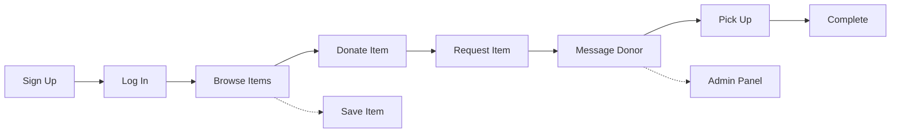

<div align="center">

# 🌱 Free Sewaa

### A community-driven donation platform for sharing reusable items and supporting people in need.

<p>
  
  
  
  
</p>

<p>
  <a href="https://free-sewaa-qh05.onrender.com">
    
  </a>
  <a href="https://github.com/CapstoneDesign-Spring2026-UlsanCollege/Free_Sewaa">
    
  </a>
  <a href="docs/README.md">
    
  </a>
  <a href="https://github.com/CapstoneDesign-Spring2026-UlsanCollege/Free_Sewaa/issues">
    
  </a>
  <a href="https://github.com/CapstoneDesign-Spring2026-UlsanCollege/Free_Sewaa/pulls">
    
  </a>
</p>

</div>

---

## Overview

**Free Sewaa** is a web-based community donation platform that makes giving simple, meaningful, and accessible. It allows users to donate reusable items, request needed resources, communicate with other users, and manage donation activity through a clean dashboard.

The project focuses on community support, sustainability, and reducing waste by helping people share useful items instead of throwing them away.

---

## Quick Links

| Resource | Link |
|---|---|
| 🌐 Live Demo | https://free-sewaa-qh05.onrender.com |
| 📂 GitHub Repository | https://github.com/CapstoneDesign-Spring2026-UlsanCollege/Free_Sewaa |
| 📖 Documentation | [docs/README.md](docs/README.md) |
| 🧪 Testing Plan | [docs/TESTING_PLAN.md](docs/TESTING_PLAN.md) |
| ✅ Release Checklist | [RELEASE_CHECKLIST.md](RELEASE_CHECKLIST.md) |
| 🎤 Demo Script | [DEMO_SCRIPT.md](DEMO_SCRIPT.md) |

---

## Features

| Feature | Description |
|---|---|
| User Authentication | Signup, login, and secure user access |
| Item Donation | Users can post reusable items for donation |
| Item Request | Users can request available items |
| Messaging | Users can communicate about donations |
| Dashboard | Users can manage their activity |
| Admin Panel | Admin can manage users, items, and reports |
| Responsive UI | Works on desktop, tablet, and mobile |

---

## Project Status

Free Sewaa is currently in its **final capstone review stage**. All core features are implemented and tested. The project is live on Render and ready for demonstration.

| Status | Detail |
|---|---|
| Phase | Final sprint — QA and documentation |
| Deployment | Live on Render |
| Test Status | 3/3 Jest tests passing |
| UI Design | Figma-inspired premium UI |

---

## Live Demo

| | Access |
|---|---|
| 🌐 Live URL | https://free-sewaa-qh05.onrender.com |
| 👤 User Account | `pathakram09555@gmail.com` / `123456` |
| 🔐 Admin Account | `admin@freesewaa.local` / `admin12345` |

> Hosted on Render free tier — may take 30-60s to wake after inactivity.

---

## Tech Stack

| Layer | Technology |
|---|---|
| Frontend | HTML5, CSS3, Vanilla JavaScript |
| Backend | Node.js (Custom HTTP Server) |
| Database | MongoDB + Mongoose-style queries |
| Testing | Jest, Supertest |
| CI/CD | GitHub Actions |
| Hosting | Render (free tier) |

---

## User Flow



---

## Installation

```bash
git clone https://github.com/CapstoneDesign-Spring2026-UlsanCollege/Free_Sewaa.git
cd Free_Sewaa
npm install
npm start
```

Open http://localhost:3000. Requires **Node.js 18+** and **MongoDB 6+**.

---

## Project Structure

```
Free_Sewaa/
├── css/           # Stylesheets
├── html/          # 18 frontend pages
├── js/            # Client-side scripts
├── server/        # Backend + Jest tests
├── docs/          # Full documentation
├── assets/        # Screenshots
├── .github/       # CI + issue templates
├── DEMO_SCRIPT.md
├── FINAL_REVIEW_NOTES.md
└── README.md
```

---

## Documentation

| Category | Link |
|---|---|
| 📖 Docs Hub | [docs/README.md](docs/README.md) |
| 🔐 Authentication | [docs/AUTHENTICATION.md](docs/AUTHENTICATION.md) |
| 🔌 API Reference | [docs/API_REFERENCE.md](docs/API_REFERENCE.md) |
| 🧪 Testing Plan | [docs/TESTING_PLAN.md](docs/TESTING_PLAN.md) |
| ✅ QA Checklist | [docs/QA_CHECKLIST.md](docs/QA_CHECKLIST.md) |
| 🗺️ User Flows | [docs/Project_UML%20diagram/README.md](docs/Project_UML%20diagram/README.md) |
| 🛠️ Setup Guide | [docs/ENVIRONMENT_SETUP.md](docs/ENVIRONMENT_SETUP.md) |
| 📦 Deployment Guide | [docs/DEPLOYMENT_GUIDE.md](docs/DEPLOYMENT_GUIDE.md) |
| 🔒 Security Plan | [docs/SECURITY_PLAN.md](docs/SECURITY_PLAN.md) |
| 🧭 Roadmap | [docs/ROADMAP.md](docs/ROADMAP.md) |
| 🔮 Future Plans | [docs/FUTURE_ENHANCEMENTS.md](docs/FUTURE_ENHANCEMENTS.md) |

### Sprint Documentation

| Week | Title | Link |
|---|---|---|
| 1 | Onboarding | [Packet](docs/sprints/Weekly%20Sprint%20Packet%20%E2%80%94%20Week%201.md) |
| 2 | Planning | [Packet](docs/sprints/Weekly%20Sprint%20Packet%20%E2%80%94%20Week%202.md) |
| 3 | Frontend MVP | [Packet](docs/sprints/Weekly%20Sprint%20Packet%20%E2%80%94%20Week%203.md) |
| 4 | Browse & Filter | [Packet](docs/sprints/Weekly%20Sprint%20Packet%20%E2%80%94%20Week%204.md) |
| 5 | UI Redesign | [Packet](docs/sprints/Weekly%20Sprint%20Packet%20%E2%80%94%20Week%205.md) |
| 6 | Backend | [Packet](docs/sprints/Weekly%20Sprint%20Packet%20%E2%80%94%20Week%206.md) |
| 7 | Midterm Prep | [Packet](docs/sprints/Weekly%20Sprint%20Packet%20%E2%80%94%20Week%207.md) |
| 8 | Midterm | [Packet](docs/sprints/Weekly%20Sprint%20Packet%20%E2%80%94%20Week%208.md) |
| 9 | Polish | [Packet](docs/sprints/Weekly%20Sprint%20Packet%20%E2%80%94%20Week%209.md) |
| 10 | Bug Triage | [Packet](docs/sprints/Weekly%20Sprint%20Packet%20%E2%80%94%20Week%2010.md) |
| 11 | MVP Verification | [Overview](docs/PROGRESS/week11/README.md) · [Packet](docs/sprints/Weekly%20Sprint%20Packet%20%E2%80%94%20Week%2011.md) |
| 12 | Final | [Sprint Packet](docs/week12/SPRINT_PACKET.md) · [QA Checklist](docs/QA_CHECKLIST.md) |

### Checklists

| Area | Link |
|---|---|
| Manual Testing | [MANUAL_TESTING_CHECKLIST.md](MANUAL_TESTING_CHECKLIST.md) |
| Accessibility | [ACCESSIBILITY_CHECKLIST.md](ACCESSIBILITY_CHECKLIST.md) |
| Security | [SECURITY_CHECKLIST.md](SECURITY_CHECKLIST.md) |
| Admin Review | [ADMIN_REVIEW_CHECKLIST.md](ADMIN_REVIEW_CHECKLIST.md) |
| Mobile Testing | [MOBILE_TESTING_CHECKLIST.md](MOBILE_TESTING_CHECKLIST.md) |
| Browser Testing | [BROWSER_TESTING_CHECKLIST.md](BROWSER_TESTING_CHECKLIST.md) |
| Form Validation | [FORM_VALIDATION_CHECKLIST.md](FORM_VALIDATION_CHECKLIST.md) |
| Deployment | [DEPLOYMENT_CHECKLIST.md](DEPLOYMENT_CHECKLIST.md) |
| Release | [RELEASE_CHECKLIST.md](RELEASE_CHECKLIST.md) |

---

## Team

Capstone Design — Spring 2026, Ulsan College

| Role | Name | Area |
|---|---|---|
| Project Manager | Ram Pathak | Coordination, timeline, sprints |
| Lead Developer | Sujan Tamang | Frontend & backend |
| Demo Driver | Mohan Khadka | Live demo, troubleshooting |
| QA Lead | Sujan Shrestha | Testing, bug tracking |
| Scribe | Swarnim Jung Karki | Docs, repo, presentations |

---

## Quick Reference

| Resource | Link |
|---|---|
| 🌐 Live Site | https://free-sewaa-qh05.onrender.com |
| 📂 Repository | https://github.com/CapstoneDesign-Spring2026-UlsanCollege/Free_Sewaa |
| 📋 Project Board | https://github.com/orgs/CapstoneDesign-Spring2026-UlsanCollege/projects/14 |
| 🐛 Issues | https://github.com/CapstoneDesign-Spring2026-UlsanCollege/Free_Sewaa/issues |
| 🔀 Pull Requests | https://github.com/CapstoneDesign-Spring2026-UlsanCollege/Free_Sewaa/pulls |
| ❤️ Health Check | `GET /api/health` → `{ "ok": true }` |

---

## License

This project is licensed under the MIT License. See the [LICENSE](LICENSE) file for details.

---

<p align="center">
  <sub>Capstone Design · Spring 2026 · Ulsan College</sub>
  <br>
  <sub>Last updated: May 2026</sub>
</p>
