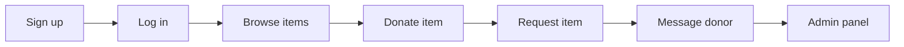

# Free Sewaa

> A community donation platform connecting donors with people who need reusable items.

[](https://opensource.org/licenses/MIT)
[](https://github.com/CapstoneDesign-Spring2026-UlsanCollege/Free_Sewaa)
[](https://nodejs.org/)
[](https://mongodb.com/)
[](https://github.com/CapstoneDesign-Spring2026-UlsanCollege/Free_Sewaa/commits/main)
[](https://github.com/CapstoneDesign-Spring2026-UlsanCollege/Free_Sewaa/issues)
[](https://github.com/CapstoneDesign-Spring2026-UlsanCollege/Free_Sewaa/pulls)

---

## Live Demo

Try Free Sewaa without installing anything:

- **URL:** https://free-sewaa-qh05.onrender.com
- **User demo:** `pathakram09555@gmail.com` / `123456`
- **Admin demo:** `admin@freesewaa.local` / `admin12345`

> ⚠ The live site runs on Render free tier. It may take 30-60 seconds to wake up after inactivity.

---

## Quick Start

```bash
git clone https://github.com/CapstoneDesign-Spring2026-UlsanCollege/Free_Sewaa.git
cd Free_Sewaa
npm install
npm start
```

Open http://localhost:3000

**Requirements:** Node.js 18+, MongoDB 6+ running locally.

---

## Features

| Feature | Description |
|---------|-------------|
| User authentication | Signup, login, logout, admin login |
| Browse items | Filter by category, view details |
| Post donations | Title, description, category, condition, image |
| Request items | Request, accept, decline, complete |
| Messaging | Conversations between donors and receivers |
| Admin panel | User management, listing moderation, stats |
| Auth flowchart | Visual auth flow diagram |
| Responsive design | Works on mobile and desktop |
| Unit tests | Jest tests on the backend |

---

## User Flow



---

## Tech Stack

**Frontend:** HTML5, CSS3, Vanilla JS · **Backend:** Node.js, Custom HTTP Server · **Database:** MongoDB

---

## Project Structure

```
Free_Sewaa/
├── css/            # Stylesheets (auth.css, style.css, theme.css)
├── html/           # 18 frontend pages (landing, auth, browse, donate, admin, etc.)
├── js/             # Frontend JavaScript (site.js, auth.js, index.js)
├── server/         # Backend server + Jest tests
├── assets/         # Screenshots and media
├── docs/           # Full project documentation
├── .github/        # Issue templates + CI workflow
├── package.json    # Root package config
├── DEMO_SCRIPT.md  # Demo presentation script
├── FINAL_REVIEW_NOTES.md # Final review notes
└── README.md       # This file
```

---

## Screenshots

Screenshots are in [`assets/screenshots/`](assets/screenshots/). See the [capture guide](assets/screenshots/README.md) for how to take them:

- Landing page, signup, dashboard
- Browse, item detail, donate form
- Messages, admin dashboard
- Mobile views

---

## Documentation

Full documentation is in the [docs/](docs/README.md) folder:

| Section | Documents |
|---------|-----------|
| **Project Info** | [Project Overview](docs/PROJECT_OVERVIEW.md) · [Requirements](docs/PRODUCT_REQUIREMENTS.md) · [Personas](docs/USER_PERSONAS.md) · [User Stories](docs/USER_STORIES.md) · [Glossary](docs/GLOSSARY.md) |
| **Architecture** | [System Design](docs/SYSTEM_ARCHITECTURE.md) · [Database Schema](docs/DATABASE_SCHEMA.md) · [Database Design](docs/DATABASE_DESIGN.md) · [API Reference](docs/API_REFERENCE.md) · [Authentication](docs/AUTHENTICATION.md) |
| **Guides** | [Frontend](docs/FRONTEND_GUIDE.md) · [Backend](docs/BACKEND_GUIDE.md) · [Admin](docs/ADMIN_GUIDE.md) · [Environment Setup](docs/ENVIRONMENT_SETUP.md) · [Deployment](docs/DEPLOYMENT_GUIDE.md) · [Troubleshooting](docs/TROUBLESHOOTING.md) |
| **Testing** | [Testing Plan](docs/TESTING_PLAN.md) · [QA Checklist](docs/QA_CHECKLIST.md) · [Test Strategy](docs/TESTING_STRATEGY.md) |
| **Security** | [Security Plan](docs/SECURITY_PLAN.md) · [Security Checklist](SECURITY_CHECKLIST.md) |
| **Management** | [Roadmap](docs/ROADMAP.md) · [Risks](docs/RISK_MANAGEMENT.md) · [Maintenance](docs/MAINTENANCE_PLAN.md) · [Future Plans](docs/FUTURE_ENHANCEMENTS.md) · [Release Notes](docs/RELEASE_NOTES.md) |
| **ADR** | [Tech Stack](docs/adr/001-technology-stack.md) · [Authentication](docs/adr/002-authentication-choice.md) · [Database](docs/adr/003-database-choice.md) |
| **Diagrams** | [UML User Flow](docs/Project_UML%20diagram/README.md) · [User Flow](docs/USER_FLOW.md) · [Auth Flow](html/auth-flow.html) |

### Sprints

| Week | Title | Link |
|------|-------|------|
| 1 | Onboarding | [Packet](docs/sprints/Weekly%20Sprint%20Packet%20—%20Week%201.md) |
| 2 | Planning | [Packet](docs/sprints/Weekly%20Sprint%20Packet%20—%20Week%202.md) |
| 3 | Frontend MVP | [Packet](docs/sprints/Weekly%20Sprint%20Packet%20—%20Week%203%20.md) |
| 4 | Browse & Filter | [Packet](docs/sprints/Weekly%20Sprint%20Packet%20—%20Week%204.md) |
| 5 | UI Redesign | [Packet](docs/sprints/Weekly%20Sprint%20Packet%20—%20Week%205.md) |
| 6 | Backend | [Packet](docs/sprints/Weekly%20Sprint%20Packet%20—%20Week%206.md) |
| 7 | Midterm Prep | [Packet](docs/sprints/Weekly%20Sprint%20Packet%20—%20Week%207.md) |
| 8 | Midterm | [Packet](docs/sprints/Weekly%20Sprint%20Packet%20—%20Week%208.md) |
| 9 | Polish | [Packet](docs/sprints/Weekly%20Sprint%20Packet%20—%20Week%209.md) |
| 10 | Bug Triage | [Packet](docs/sprints/Weekly%20Sprint%20Packet%20—%20Week%2010.md) |
| 11 | MVP Verification | [Overview](docs/PROGRESS/week11/README.md) |
| 12 | Final | [Sprint Packet](docs/week12/SPRINT_PACKET.md) · [QA Checklist](docs/QA_CHECKLIST.md) |

### Checklists

| Checklist | Link |
|-----------|------|
| Manual Testing | [`MANUAL_TESTING_CHECKLIST.md`](MANUAL_TESTING_CHECKLIST.md) |
| Accessibility | [`ACCESSIBILITY_CHECKLIST.md`](ACCESSIBILITY_CHECKLIST.md) |
| Security | [`SECURITY_CHECKLIST.md`](SECURITY_CHECKLIST.md) |
| Admin Review | [`ADMIN_REVIEW_CHECKLIST.md`](ADMIN_REVIEW_CHECKLIST.md) |
| Mobile Testing | [`MOBILE_TESTING_CHECKLIST.md`](MOBILE_TESTING_CHECKLIST.md) |
| Browser Testing | [`BROWSER_TESTING_CHECKLIST.md`](BROWSER_TESTING_CHECKLIST.md) |
| Form Validation | [`FORM_VALIDATION_CHECKLIST.md`](FORM_VALIDATION_CHECKLIST.md) |
| Deployment | [`DEPLOYMENT_CHECKLIST.md`](DEPLOYMENT_CHECKLIST.md) |
| Release | [`RELEASE_CHECKLIST.md`](RELEASE_CHECKLIST.md) |
| QA Checklist | [`docs/QA_CHECKLIST.md`](docs/QA_CHECKLIST.md) |

### Templates

- [Bug Report](.github/ISSUE_TEMPLATE/bug_report.md)
- [Feature Request](.github/ISSUE_TEMPLATE/feature_request.md)
- [Documentation Task](.github/ISSUE_TEMPLATE/documentation_task.md)
- [Pull Request](.github/pull_request_template.md)

---

## Quick Reference

- **Live site:** https://free-sewaa-qh05.onrender.com
- **Health check:** `GET /api/health` — returns `{ "ok": true }`
- **Repository:** https://github.com/CapstoneDesign-Spring2026-UlsanCollege/Free_Sewaa
- **Project board:** https://github.com/orgs/CapstoneDesign-Spring2026-UlsanCollege/projects/14
- **Issues:** https://github.com/CapstoneDesign-Spring2026-UlsanCollege/Free_Sewaa/issues
- **Pull requests:** https://github.com/CapstoneDesign-Spring2026-UlsanCollege/Free_Sewaa/pulls
- **Commands:** `npm install`, `npm start`, `npm test` (in server/)

---

## Team

Capstone Design — Spring 2026, Ulsan College

| Role | Name | Responsibilities |
|------|------|------------------|
| Project Manager | Ram Pathak | Coordination, timeline, sprint management |
| Lead Developer | Sujan Tamang | Frontend & backend development |
| Demo Driver | Mohan Khadka | Live demo presentation, troubleshooting |
| QA Lead | Sujan Shrestha | Testing, bug verification, quality checks |
| Scribe | Swarnim Jung Karki | Documentation, repo management, presentation |

---

## License

MIT

---

*Last updated: May 2026*
