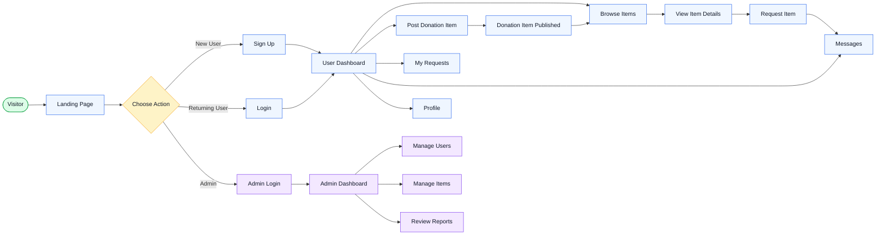
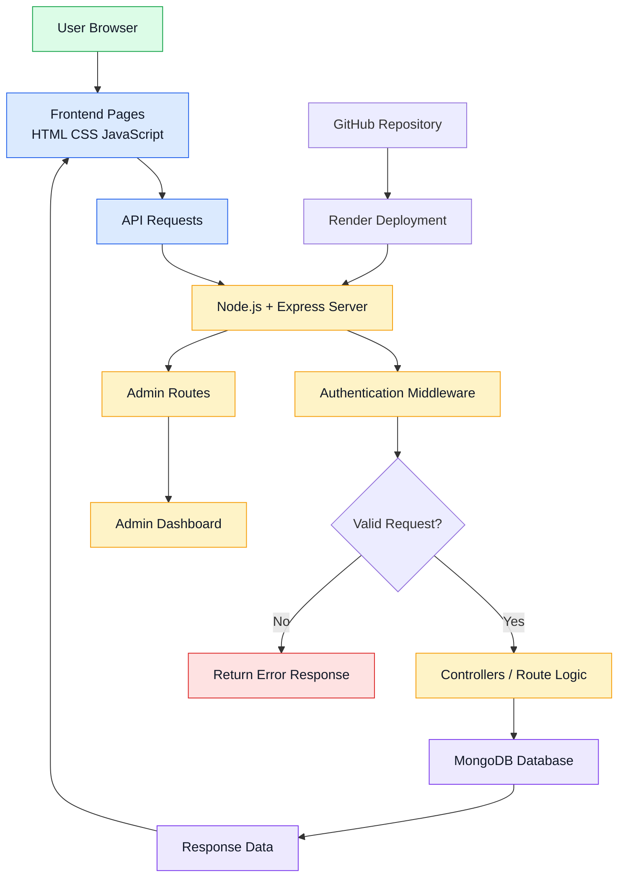

<div align="center">

# 🌱 Free Sewaa

### A community-driven donation platform that makes giving simple and meaningful.

🌱 Free Sewaa helps people share reusable items for free, support others in need 🤝, and reduce waste ♻️ through a smarter community exchange.

<p>
  
  
  
  
</p>

<p>
  
  
  
  
</p>

<p>
  <a href="https://free-sewaa-qh05.onrender.com">
    
  </a>
  <a href="https://github.com/CapstoneDesign-Spring2026-UlsanCollege/Free_Sewaa">
    
  </a>
  <a href="docs/README.md">
    
  </a>
  <a href="https://github.com/CapstoneDesign-Spring2026-UlsanCollege/Free_Sewaa/issues">
    
  </a>
  <a href="https://github.com/CapstoneDesign-Spring2026-UlsanCollege/Free_Sewaa/pulls">
    
  </a>
</p>

</div>

---

## 📖 Overview

**Free Sewaa** is a web-based community donation platform that allows users to donate reusable items, request needed resources, communicate with other users, and manage donation activity through a simple dashboard. The project focuses on community support, sustainability, and reducing waste by helping people share useful items instead of throwing them away.

---

## 🧭 App Workflow

This diagram shows the main Free Sewaa user journey from entering the platform to donating, requesting, messaging, and admin review.



---

## 🏗️ System Workflow

This diagram shows how the frontend, backend, authentication, database, and deployment work together.



---

## 🔄 Donation Request Flow

This diagram shows how a donated item moves through the platform.

```mermaid
flowchart LR
    A[Donor Posts Item] --> B[Item Appears in Browse Page]
    B --> C[Receiver Views Item]
    C --> D[Receiver Sends Request]
    D --> E[Donor and Receiver Communicate]
    E --> F[Item Handover]
    F --> G[Request Completed]

    classDef donor fill:#DCFCE7,stroke:#16A34A,color:#111827;
    classDef receiver fill:#DBEAFE,stroke:#2563EB,color:#111827;
    classDef process fill:#F8FAFC,stroke:#64748B,color:#111827;
    classDef done fill:#ECFDF5,stroke:#059669,color:#111827;

    class A donor;
    class C,D receiver;
    class B,E,F process;
    class G done;
```



> For the complete user flow documentation, see [docs/USER_FLOW.md](docs/USER_FLOW.md).

---

## 💡 Why Free Sewaa?

| Problem | Free Sewaa Solution |
|---|---|
| Useful items are often wasted | Users can donate reusable items |
| People may need items but cannot afford them | Users can request free items |
| Donation process is usually unorganized | Dashboard and request system organize activity |
| Communities need better sharing tools | Free Sewaa connects donors and receivers |

---

## ✨ Core Features

| Feature | Description |
|---|---|
| User Authentication | Signup and login for secure access |
| Item Donation | Users can post reusable items for donation |
| Item Request | Users can request available donation items |
| Messaging | Users can communicate about donation items |
| User Dashboard | Users can manage posts, requests, and activity |
| Admin Panel | Admin can manage users, items, and reports |
| Responsive Design | Works on desktop, tablet, and mobile |
| Documentation | Includes project guide, testing plan, audit checklist, and roadmap |

---

## 🗺️ Project Navigation

| Section | Link |
|---|---|
| 🌐 Live Demo | https://free-sewaa-qh05.onrender.com |
| 📂 GitHub Repository | https://github.com/CapstoneDesign-Spring2026-UlsanCollege/Free_Sewaa |
| 📖 Documentation Home | [docs/README.md](docs/README.md) |
| 🔄 User Flow | [docs/USER_FLOW.md](docs/USER_FLOW.md) |
| 🏗️ System Architecture | [docs/SYSTEM_ARCHITECTURE.md](docs/SYSTEM_ARCHITECTURE.md) |
| 🔌 API Reference | [docs/API_REFERENCE.md](docs/API_REFERENCE.md) |
| 🗃️ Database Design | [docs/DATABASE_DESIGN.md](docs/DATABASE_DESIGN.md) |
| 🧪 Testing Plan | [docs/TESTING_PLAN.md](docs/TESTING_PLAN.md) |
| 📋 Audit Checklist | [docs/AUDIT_CHECKLIST.md](docs/AUDIT_CHECKLIST.md) |
| ✅ Release Checklist | [RELEASE_CHECKLIST.md](RELEASE_CHECKLIST.md) |
| 🎤 Demo Script | [DEMO_SCRIPT.md](DEMO_SCRIPT.md) |
| 🧭 Roadmap | [docs/ROADMAP.md](docs/ROADMAP.md) |
| 🔮 Future Enhancements | [docs/FUTURE_ENHANCEMENTS.md](docs/FUTURE_ENHANCEMENTS.md) |
| 🚀 Deployment Guide | [docs/DEPLOYMENT_GUIDE.md](docs/DEPLOYMENT_GUIDE.md) |
| 🔒 Security | [SECURITY.md](SECURITY.md) |
| 🤝 Contributing | [CONTRIBUTING.md](CONTRIBUTING.md) |
| 📄 License | [MIT](https://opensource.org/licenses/MIT) |

---

## 🎯 For Reviewers

| What to Check | Link |
|---|---|
| 📖 Project Overview | [docs/PROJECT_OVERVIEW.md](docs/PROJECT_OVERVIEW.md) |
| 🎤 Final Demo Script | [DEMO_SCRIPT.md](DEMO_SCRIPT.md) |
| ✅ Release Checklist | [RELEASE_CHECKLIST.md](RELEASE_CHECKLIST.md) |
| 🧪 Testing Plan | [docs/TESTING_PLAN.md](docs/TESTING_PLAN.md) |
| 📋 Audit Checklist | [docs/AUDIT_CHECKLIST.md](docs/AUDIT_CHECKLIST.md) |
| 🔮 Future Plan | [docs/FUTURE_ENHANCEMENTS.md](docs/FUTURE_ENHANCEMENTS.md) |
| 📊 Project Status | [docs/PROJECT_OVERVIEW.md](docs/PROJECT_OVERVIEW.md) |

---

## 🛠️ Tech Stack

| Layer | Technology |
|---|---|
| Frontend | HTML, CSS, JavaScript |
| Backend | Node.js, Express.js |
| Database | MongoDB |
| Authentication | JWT |
| Deployment | Render |
| Version Control | GitHub |

---

## 🚀 Quick Start

```bash
git clone https://github.com/CapstoneDesign-Spring2026-UlsanCollege/Free_Sewaa.git
cd Free_Sewaa
npm install
npm start
```

Open [http://localhost:3000](http://localhost:3000). Requires **Node.js 18+** and **MongoDB 6+**.

---

## 📊 Project Status

Free Sewaa is currently in the **final capstone review stage**. The main focus is project polish, testing, documentation, final demo readiness, and future improvement planning.

| Status | Detail |
|---|---|
| Phase | Final sprint — QA and documentation |
| Deployment | Live on Render |
| Test Status | 3/3 Jest tests passing |
| UI Design | Figma-inspired premium UI |

### Demo Credentials

| Role | Email | Password |
|---|---|---|
| 👤 User | `pathakram09555@gmail.com` | `123456` |
| 🔐 Admin | `admin@freesewaa.local` | `admin12345` |

---

## 🔮 Future Improvements

- Location-based item search
- Better image upload experience
- Email or push notifications
- User rating and trust system
- Admin analytics dashboard
- Multi-language support
- Dark mode
- Accessibility improvements

---

## 📄 License

This project is licensed under the MIT License. See the [LICENSE](https://opensource.org/licenses/MIT) file for details.

---

<p align="center">
  <sub>Capstone Design · Spring 2026 · Ulsan College</sub>
  <br>
  <sub>Last updated: May 2026</sub>
</p>
