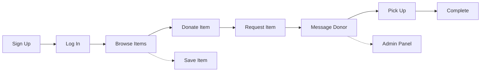

<div align="center">

# Free Sewaa

### A community donation platform for sharing reusable items and helping people in need.

<p>
  
  
  
  
</p>

<p>
  <a href="https://free-sewaa-qh05.onrender.com">
    
  </a>
  <a href="docs/README.md">
    
  </a>
  <a href="https://github.com/CapstoneDesign-Spring2026-UlsanCollege/Free_Sewaa/issues">
    
  </a>
  <a href="https://github.com/CapstoneDesign-Spring2026-UlsanCollege/Free_Sewaa/pulls">
    
  </a>
</p>

</div>

---

## Overview

**Free Sewaa** is a web-based community donation platform that helps users donate reusable items, request needed items, communicate with other users, and manage activity through a simple dashboard.

The project was developed as a capstone project for Ulsan College with a focus on community support, sustainability, and accessible donation management.

<br>

## 🎯 Live Demo

| | Access |
|---|---|
| 🌐 **Live URL** | [https://free-sewaa-qh05.onrender.com](https://free-sewaa-qh05.onrender.com) |
| 👤 **User Account** | `pathakram09555@gmail.com` / `123456` |
| 🔐 **Admin Account** | `admin@freesewaa.local` / `admin12345` |

> ⚠️ Hosted on Render free tier — may take 30-60s to wake after inactivity.

<br>

## ⚙️ Installation

```bash
git clone https://github.com/CapstoneDesign-Spring2026-UlsanCollege/Free_Sewaa.git
cd Free_Sewaa
npm install
npm start
```

Open [http://localhost:3000](http://localhost:3000). Requires **Node.js 18+** and **MongoDB 6+**.

<p align="left">
  
  
  
</p>

<br>

## ✨ Features

| Feature | What it does |
|---|---|
| 🔐 **Authentication** | Signup, login, logout, and admin login |
| 📦 **Browse Items** | Filter by category, condition, and location |
| 🎁 **Post Donations** | Title, description, images, condition, pickup details |
| 📋 **Request Items** | Request, accept, decline, and complete |
| 💬 **Messaging** | Direct conversations between donors and receivers |
| 🛡️ **Admin Panel** | User management, listing moderation, platform stats |
| 📊 **Auth Flowchart** | Visual user journey from signup to dashboard |
| 📱 **Responsive Design** | Works on mobile, tablet, and desktop |
| ✅ **Unit Tests** | Jest tests covering backend endpoints |

<br>

## 🔄 User Flow



<br>

## 🧰 Tech Stack

<p align="left">
  
  
  
  
  
  
  
</p>

| Layer | Technology |
|---|---|
| **Frontend** | HTML5, CSS3, Vanilla JavaScript |
| **Backend** | Node.js (Custom HTTP Server) |
| **Database** | MongoDB + Mongoose-style queries |
| **Testing** | Jest, Supertest |
| **CI/CD** | GitHub Actions |
| **Hosting** | Render (free tier) |

<br>

## 📁 Project Structure

```
Free_Sewaa/
├── css/           # Stylesheets
├── html/          # 18 frontend pages
├── js/            # Client-side scripts
├── server/        # Backend + Jest tests
├── docs/          # Full documentation
├── assets/        # Screenshots
├── .github/       # CI + issue templates
├── DEMO_SCRIPT.md
├── FINAL_REVIEW_NOTES.md
└── README.md
```

<br>

## 📚 Documentation

<p align="center">
  <a href="docs/README.md"></a>
  <a href="docs/API_REFERENCE.md"></a>
  <a href="docs/Project_UML%20diagram/README.md"></a>
  <a href="https://github.com/CapstoneDesign-Spring2026-UlsanCollege/Free_Sewaa/pulls"></a>
</p>

| Category | Description | Link |
|---|---|---|
| 📖 **Docs Hub** | Complete documentation index | [View](docs/README.md) |
| 🔐 **Authentication** | Login, signup, admin auth flow | [View](docs/AUTHENTICATION.md) |
| 🔌 **API Reference** | All backend endpoints | [View](docs/API_REFERENCE.md) |
| 🗺️ **User Flows** | UML diagrams for all user journeys | [View](docs/Project_UML%20diagram/README.md) |
| 🗓️ **Sprints** | Weekly sprint packets (Weeks 1-12) | [View](docs/sprints/) |
| 🧪 **Testing Plan** | Unit, integration, E2E, security tests | [View](docs/TESTING_PLAN.md) |
| ✅ **QA Checklist** | Pre-release quality checks | [View](docs/QA_CHECKLIST.md) |
| 📦 **Deployment** | Render deployment guide | [View](docs/DEPLOYMENT_GUIDE.md) |
| 🛠️ **Setup Guide** | Environment setup instructions | [View](docs/ENVIRONMENT_SETUP.md) |
| 🔒 **Security Plan** | Security measures and known gaps | [View](docs/SECURITY_PLAN.md) |
| 🧭 **Roadmap** | Project roadmap and milestones | [View](docs/ROADMAP.md) |
| 🔮 **Future Plans** | Short and long-term enhancements | [View](docs/FUTURE_ENHANCEMENTS.md) |

### Sprint Documentation

| Week | Title | Link |
|---|---|---|
| 1 | Onboarding | [Packet](docs/sprints/Weekly%20Sprint%20Packet%20%E2%80%94%20Week%201.md) |
| 2 | Planning | [Packet](docs/sprints/Weekly%20Sprint%20Packet%20%E2%80%94%20Week%202.md) |
| 3 | Frontend MVP | [Packet](docs/sprints/Weekly%20Sprint%20Packet%20%E2%80%94%20Week%203.md) |
| 4 | Browse & Filter | [Packet](docs/sprints/Weekly%20Sprint%20Packet%20%E2%80%94%20Week%204.md) |
| 5 | UI Redesign | [Packet](docs/sprints/Weekly%20Sprint%20Packet%20%E2%80%94%20Week%205.md) |
| 6 | Backend | [Packet](docs/sprints/Weekly%20Sprint%20Packet%20%E2%80%94%20Week%206.md) |
| 7 | Midterm Prep | [Packet](docs/sprints/Weekly%20Sprint%20Packet%20%E2%80%94%20Week%207.md) |
| 8 | Midterm | [Packet](docs/sprints/Weekly%20Sprint%20Packet%20%E2%80%94%20Week%208.md) |
| 9 | Polish | [Packet](docs/sprints/Weekly%20Sprint%20Packet%20%E2%80%94%20Week%209.md) |
| 10 | Bug Triage | [Packet](docs/sprints/Weekly%20Sprint%20Packet%20%E2%80%94%20Week%2010.md) |
| 11 | MVP Verification | [Overview](docs/PROGRESS/week11/README.md) · [Packet](docs/sprints/Weekly%20Sprint%20Packet%20%E2%80%94%20Week%2011.md) |
| 12 | Final | [Sprint Packet](docs/week12/SPRINT_PACKET.md) · [QA Checklist](docs/QA_CHECKLIST.md) |

### Checklists

| Area | Link |
|---|---|
| 🧪 Manual Testing | [Checklist](MANUAL_TESTING_CHECKLIST.md) |
| ♿ Accessibility | [Checklist](ACCESSIBILITY_CHECKLIST.md) |
| 🔒 Security | [Checklist](SECURITY_CHECKLIST.md) |
| 🛡️ Admin Review | [Checklist](ADMIN_REVIEW_CHECKLIST.md) |
| 📱 Mobile Testing | [Checklist](MOBILE_TESTING_CHECKLIST.md) |
| 🌐 Browser Testing | [Checklist](BROWSER_TESTING_CHECKLIST.md) |
| 📝 Form Validation | [Checklist](FORM_VALIDATION_CHECKLIST.md) |
| 🚀 Deployment | [Checklist](DEPLOYMENT_CHECKLIST.md) |
| 📦 Release | [Checklist](RELEASE_CHECKLIST.md) |

<br>

## 👥 Team

Capstone Design — Spring 2026, Ulsan College

| Role | Name | Area |
|---|---|---|
| 👨‍💼 Project Manager | Ram Pathak | Coordination, timeline, sprints |
| 👨‍💻 Lead Developer | Sujan Tamang | Frontend & backend |
| 🎤 Demo Driver | Mohan Khadka | Live demo, troubleshooting |
| 🧪 QA Lead | Sujan Shrestha | Testing, bug tracking |
| 📝 Scribe | Swarnim Jung Karki | Docs, repo, presentations |

<br>

## 🔗 Quick Reference

| Resource | Link |
|---|---|
| 🌐 Live Site | [free-sewaa-qh05.onrender.com](https://free-sewaa-qh05.onrender.com) |
| 📂 Repository | [GitHub](https://github.com/CapstoneDesign-Spring2026-UlsanCollege/Free_Sewaa) |
| 📋 Project Board | [GitHub Projects](https://github.com/orgs/CapstoneDesign-Spring2026-UlsanCollege/projects/14) |
| 🐛 Issues | [GitHub Issues](https://github.com/CapstoneDesign-Spring2026-UlsanCollege/Free_Sewaa/issues) |
| 🔀 Pull Requests | [GitHub PRs](https://github.com/CapstoneDesign-Spring2026-UlsanCollege/Free_Sewaa/pulls) |
| ❤️ Health Check | `GET /api/health` → `{ "ok": true }` |

<br>

## 📄 License

[MIT](https://opensource.org/licenses/MIT)

---

<p align="center">
  <sub>Capstone Design · Spring 2026 · Ulsan College</sub>
  <br>
  <sub>Last updated: May 2026</sub>
</p>
