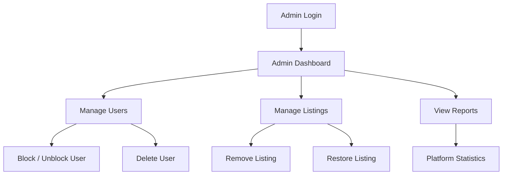

# Admin Guide

## Admin Login

Admin users log in through the admin login page (`/admin_login.html`) using credentials with the `superadmin` role in the database.

**Demo admin credentials (safe for presentation):**
- Email: `admin@freesewaa.local`
- Password: `admin12345`

## Admin Dashboard

After login, the admin dashboard shows:

## Features

### Manage Users
- View all registered users
- Block a user to prevent login
- Unblock a previously blocked user
- Delete user accounts (with protection for superadmin accounts)

### Manage Listings
- View all donation listings across the platform
- Remove inappropriate listings
- Restore previously removed listings

### View Reports
- Platform overview: total users, total listings, total requests, total conversations
- Recent user registrations
- Recent listings

## Admin Security Rules

- A superadmin cannot block, demote, or delete their own account
- Only users with `role: "superadmin"` can access admin endpoints
- Admin actions are tracked in the audit log

---

*Last updated: May 2026*
