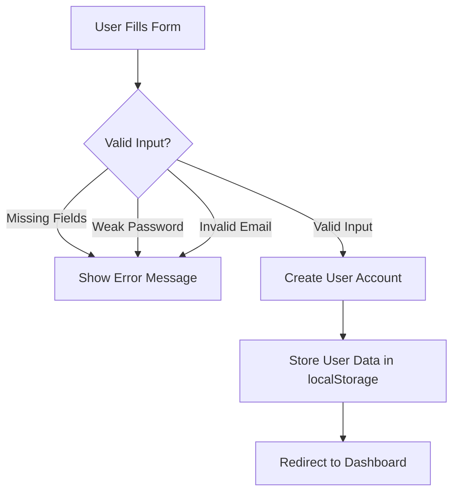
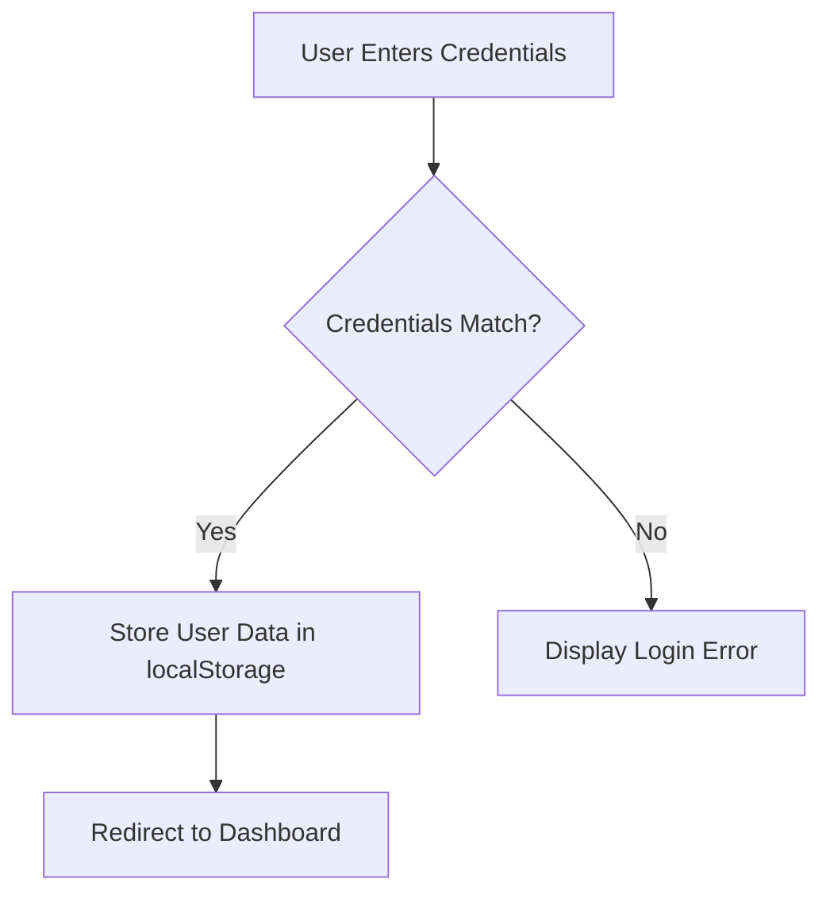

# Authentication — Free Sewaa

## Overview

Free Sewaa uses a localStorage-based authentication system for managing user sessions. After a successful signup or login, the application stores the user's authentication status, user ID, and profile information in the browser's localStorage.

### Authentication Data Stored

```javascript
localStorage.setItem('freesewaa-auth', 'true');
localStorage.setItem('freesewaa-current-user-id', 'user-a1b2c3d4');
localStorage.setItem('freesewaa-user', JSON.stringify(userObject));
```

API requests include user identification through either:

- `userId` query parameter (`?userId=...`)
- `x-user-id` request header

---

## Signup Flow

The signup process validates user input before creating a new account.



### Signup Validation Rules

- All required fields must be completed.
- Email must use a recognized email provider.
- Password must meet the defined security requirements.
- Duplicate email addresses are not allowed.

---

## Login Flow

The login process verifies user credentials and establishes an authenticated session.



### Login Process

1. User enters email and password.
2. System validates credentials.
3. User information is stored in localStorage.
4. User is redirected to the dashboard.
5. Protected features become accessible.

---

## Security Notes

### Current Security Features

- Email domain validation is enforced.
- Password complexity requirements are implemented.
- Protected routes require user authentication.
- Role-based access control is available for administrators.

### Password Policy

Passwords must:

- Be between 8 and 10 characters long.
- Include at least one uppercase letter.
- Include at least one lowercase letter.
- Include at least one numeric digit.

### Email Validation

Only recognized email providers are accepted, including:

- gmail.com
- naver.com
- outlook.com
- yahoo.com

### Admin Identification

Administrative accounts are identified using the `role` field:

```json
{
  "role": "superadmin"
}
```

### Alternative Authentication

Firebase token authentication is also available as an optional authentication method.

---

## Protected Routes

Most API endpoints require a valid authenticated user.

### Authentication Verification Process

The server checks for authentication using:

1. `userId` query parameter
2. `x-user-id` request header (fallback)

### Unauthorized Requests

If a valid user ID is not found, the server returns:

```http
401 Unauthorized
```

Example response:

```json
{
  "error": "Unauthorized"
}
```

---

## Admin Access Control

Administrative access is determined through two methods:

### 1. Database Role Check

```json
{
  "role": "superadmin"
}
```

### 2. Environment Variable Validation

The system also checks against:

- `SUPER_ADMIN_EMAILS`
- `SUPER_ADMIN_USER_IDS`

Users matching either configuration are granted administrator privileges.

---

## Logout Process

When a user logs out:

1. Authentication data is removed from localStorage.
2. User session is cleared.
3. User is redirected to the landing page.

### Logout Example

```javascript
localStorage.removeItem('freesewaa-auth');
localStorage.removeItem('freesewaa-current-user-id');
localStorage.removeItem('freesewaa-user');
```

After logout:

```text
User → Landing Page
```

---

## Known Limitations

| Limitation | Impact |
|------------|---------|
| localStorage-based authentication | Less secure than server-side sessions or JWT |
| Plaintext password storage | Security risk in production |
| No automatic session expiration | Users remain logged in until logout |
| No multi-factor authentication | Additional security layer not implemented |

### Planned Improvements

- Implement password hashing using bcryptjs.
- Add JWT-based authentication.
- Introduce session expiration and refresh tokens.
- Add multi-factor authentication (MFA).
- Improve server-side authorization checks.

---
