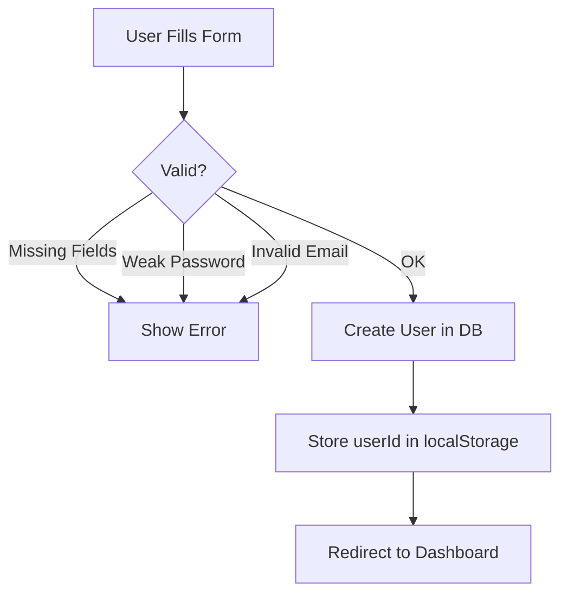
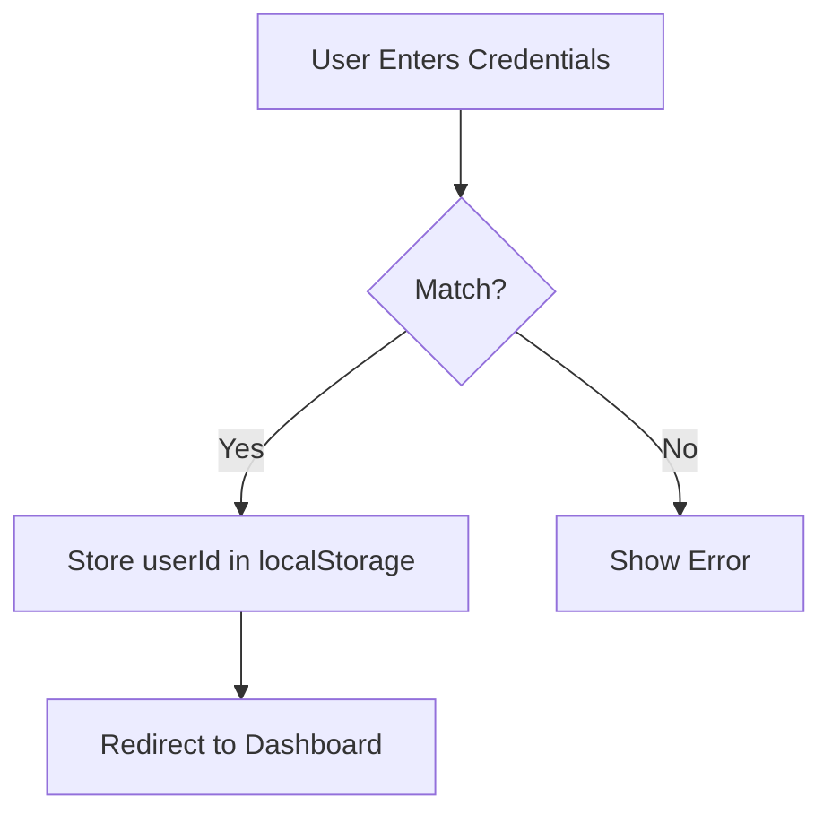

# Authentication

## Overview

Free Sewaa uses localStorage-based authentication. After a successful login or signup, the frontend stores the user ID and user object in the browser's localStorage.

```js
localStorage.setItem('freesewaa-auth', 'true');
localStorage.setItem('freesewaa-current-user-id', 'user-...');
localStorage.setItem('freesewaa-user', JSON.stringify(userObject));
```

API calls include the userId as a query parameter (`?userId=...`) or `x-user-id` header.

## Signup Flow



## Login Flow



## Security Notes

- Passwords are currently stored in plaintext. The `bcryptjs` library is installed and available for production use.
- Email domain validation is enforced (only recognized providers like gmail.com, naver.com, etc.)
- Password policy: 8-10 characters, must include uppercase, lowercase, and a number
- Admin accounts are identified by the `role` field in the database (`superadmin`)
- Firebase token authentication is available as an alternative sign-in method

## Protected Routes

Most API endpoints require a valid userId to be sent with the request. The server checks:

1. The `userId` query parameter
2. The `x-user-id` header (as fallback)

If no valid userId is found, the server returns a 401 Unauthorized response.

## Admin Access

Admin access is determined by:
1. The user's `role` field in the database (`superadmin`)
2. Matching email or userId in `SUPER_ADMIN_EMAILS` / `SUPER_ADMIN_USER_IDS` env variables

## Logout

Logout clears the localStorage entries and redirects the user to the landing page.

---

*Last updated: May 2026*
