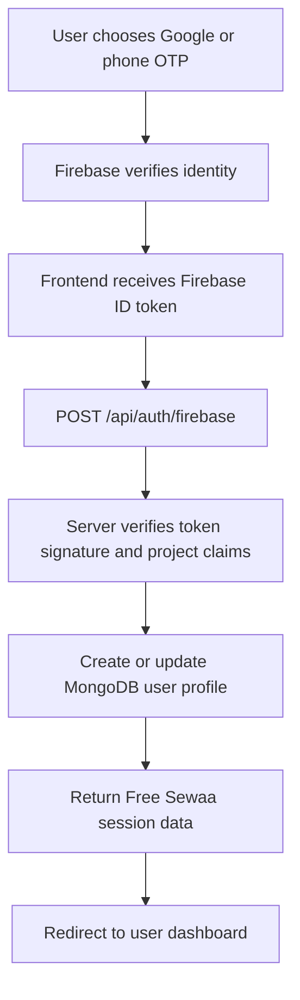

# Authentication — Free Sewaa

## Overview

Free Sewaa now supports Firebase identity verification through the final Firebase project `freesewaa-c8a41` while keeping the existing local email/password flow available for continuity.

Supported user sign-in paths:

- Google Sign-In through Firebase Authentication.
- Phone SMS OTP through Firebase Authentication and reCAPTCHA.
- Existing local email/password accounts stored in MongoDB.

Admin login remains separate. Google and phone OTP do not grant admin access unless the signed-in user also matches `SUPER_ADMIN_EMAILS` or `SUPER_ADMIN_USER_IDS`.

## Firebase Project

The production Firebase project is:

```text
freesewaa-c8a41
```

Runtime configuration is served from `/firebase-config.js` and should match the same project in:

- `firebase-config.js`
- Render environment variables
- `FIREBASE_PROJECT_ID`
- Firebase authorized domains for Render, Vercel, and local development

Configured authorized domains: `localhost`, `free-sewaa-qh05.onrender.com`, `free-sewaa.vercel.app`, `freesewaa-c8a41.firebaseapp.com`, and `freesewaa-c8a41.web.app`.

## Verified Identity Flow



The backend verifies Firebase ID tokens against Google's public signing certificates. It checks:

- Token has a valid RS256 signature.
- `aud` matches `freesewaa-c8a41`.
- `iss` matches `https://securetoken.google.com/freesewaa-c8a41`.
- Token has not expired.
- Phone users include a verified phone number.
- Firebase email/password users must have `email_verified=true`.

## Google Sign-In

Google Sign-In is the strongest demo-ready verification path because Google verifies the user's email identity before Firebase returns the ID token.

Frontend behavior:

1. User clicks **Continue with Google**.
2. Firebase opens the Google account picker.
3. The frontend sends the Firebase ID token to `/api/auth/firebase`.
4. The backend creates or updates the Free Sewaa MongoDB user.
5. The user is redirected to the dashboard.

## Phone OTP

Phone OTP is available through Firebase Phone Authentication. South Korea is explicitly allowed in the Firebase SMS region policy. Korean mobile numbers must use international format:

```text
010-1234-5678 → +82 10-1234-5678
```

The current Spark project reports a real SMS quota of 10 messages per day. A configured test-number fallback remains available:

```text
Test phone: +1 650-555-3434
Test OTP:   654321
```

Firebase does not send an SMS for the configured test number.

Frontend behavior:

1. User enters a phone number in international format.
2. Firebase reCAPTCHA validates the browser session.
3. Firebase sends an SMS OTP.
4. User enters the code.
5. The frontend sends the verified Firebase ID token to `/api/auth/firebase`.

Use the configured test phone during grading rehearsals to avoid quota or billing surprises.

## Email Verification

Firebase email verification is supported through passwordless email sign-in links. The link is sent by Firebase and opening it proves ownership of the Gmail or other recognized email address.

Important distinction:

- Firebase-native email verification uses a verification link.
- Firebase web authentication does not provide a built-in numeric email OTP.
- A real six-digit email OTP would require extra backend endpoints, hashed OTP storage, expiry handling, and an email provider or Firebase Trigger Email extension.

The existing local email/password flow is still available so current demo accounts are not broken.

## Local Session Storage

After any successful login path, the app stores the Free Sewaa session in browser localStorage:

```javascript
localStorage.setItem('freesewaa-auth', 'true');
localStorage.setItem('freesewaa-current-user-id', userId);
localStorage.setItem('freesewaa-user', JSON.stringify(userObject));
```

API requests continue to identify users through:

- `userId` query parameter (`?userId=...`)
- `x-user-id` request header

## Security Notes

Current security strengths:

- Firebase verifies Google and phone identities.
- Backend verifies Firebase token signatures server-side.
- Admin login is isolated from public Google/OTP user login.
- Email domain validation remains for local email/password accounts.
- Password complexity requirements remain for local accounts.

Known limitations:

| Limitation | Impact | Next Step |
|------------|--------|-----------|
| Local email/password still uses legacy storage | Existing accounts remain usable but should be retired later | Migrate fully to Firebase or hash passwords |
| localStorage session | Less secure than server-side sessions or HTTP-only cookies | Add signed session/JWT refresh flow |
| Phone OTP quota | SMS may fail if Firebase quota/billing is limited | Use Firebase test numbers for demo |
| Numeric email OTP not native | Requires extra provider/backend work | Use Firebase email verification link for now |

## Logout

Logout removes the local Free Sewaa session:

```javascript
localStorage.removeItem('freesewaa-auth');
localStorage.removeItem('freesewaa-current-user-id');
localStorage.removeItem('freesewaa-user');
localStorage.removeItem('freesewaa-token');
```
