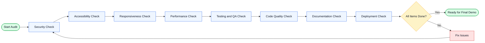

# Free Sewaa — Best Practice Audit

This document is used to review the Free Sewaa project before final submission, demo, or deployment. Each section contains checklist items to verify that the project meets professional quality standards.

---

## How to Use This Audit

Use this checklist before the final demo, release, or project review.

- [ ] Not completed
- [x] Completed

Tick each item only after it has been checked and confirmed.

---

## Audit Workflow

---

## 1. Security Audit

- [ ] No secrets, API keys, passwords, or tokens are committed
- [ ] .env file is ignored and not pushed to GitHub
- [ ] Passwords are not stored in plain text
- [ ] JWT/session handling is protected
- [ ] User dashboard requires login
- [ ] Admin dashboard is restricted to admin users only
- [ ] Forms validate input before submission
- [ ] Error messages do not reveal sensitive system details

## 2. Accessibility Audit

- [ ] Images have meaningful alt text
- [ ] Buttons and links have clear labels
- [ ] Forms have labels or helpful placeholders
- [ ] Text is readable on mobile and desktop
- [ ] Color contrast is comfortable
- [ ] Keyboard navigation works
- [ ] Focus states are visible
- [ ] Error messages are easy to understand

## 3. Responsiveness Audit

- [ ] Website works on mobile
- [ ] Website works on tablet
- [ ] Website works on desktop
- [ ] No horizontal scrolling issue
- [ ] Cards and sections stack properly on small screens
- [ ] Navbar is usable on mobile
- [ ] Forms fit within screen width
- [ ] Buttons are easy to tap

## 4. Performance Audit

- [ ] Pages load without long delay
- [ ] Images are optimized
- [ ] No major console errors
- [ ] CSS and JavaScript are not unnecessarily duplicated
- [ ] Large lists do not freeze the page
- [ ] Render deployment loads correctly
- [ ] Navigation feels smooth
- [ ] Unused files are removed where possible

## 5. Testing and QA Audit

- [ ] Signup works
- [ ] Login works
- [ ] Logout works
- [ ] User dashboard works
- [ ] Item posting works
- [ ] Item request works
- [ ] Messaging works
- [ ] Admin login works
- [ ] Admin dashboard works
- [ ] Main user flow works from start to end

## 6. Code Quality Audit

- [ ] File names are clear
- [ ] Folder structure is understandable
- [ ] Repeated code is reduced where possible
- [ ] Unused comments are removed
- [ ] Function and variable names are meaningful
- [ ] CSS classes are organized
- [ ] No unnecessary files are committed
- [ ] Code is readable for future team members

## 7. Documentation Audit

- [ ] README is clean and updated
- [ ] Live demo link works
- [ ] GitHub repository link is visible
- [ ] Setup steps are easy to follow
- [ ] User flow is documented
- [ ] Testing plan exists
- [ ] Audit checklist exists
- [ ] Future improvements are realistic
- [ ] Documentation links work correctly

## 8. Deployment Audit

- [ ] Render live site opens
- [ ] Environment variables are set correctly
- [ ] Database connects properly
- [ ] No deployment error appears
- [ ] Main pages work in production
- [ ] App does not expose private keys
- [ ] Release checklist is completed before demo

---

## Audit Status

| Audit Area | Status | Notes |
|---|---|---|
| Security | Not Checked / In Progress / Passed | |
| Accessibility | Not Checked / In Progress / Passed | |
| Responsiveness | Not Checked / In Progress / Passed | |
| Performance | Not Checked / In Progress / Passed | |
| Testing and QA | Not Checked / In Progress / Passed | |
| Code Quality | Not Checked / In Progress / Passed | |
| Documentation | Not Checked / In Progress / Passed | |
| Deployment | Not Checked / In Progress / Passed | |
