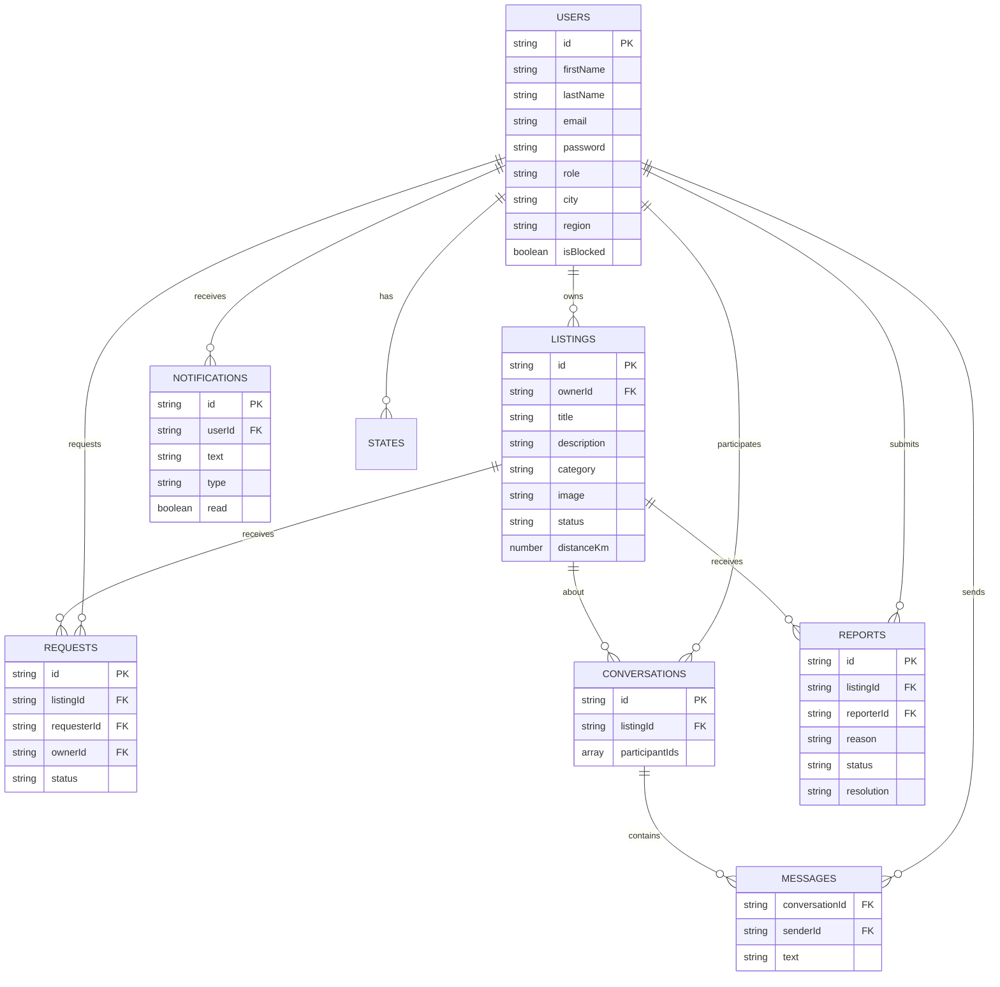

# Database Design

## Collections

Free Sewaa uses MongoDB with 11 collections. All IDs are custom string IDs (e.g. `user-1712345678`, `listing-201`).

See the full schema at [DATABASE_SCHEMA.md](DATABASE_SCHEMA.md) for detailed field listings.

## Key Relationships

- A **User** can own many **Listings** (donor)
- A **User** can make many **Requests**
- A **Listing** can receive many **Requests**
- A **Conversation** belongs to a **Listing** and has many **Messages**
- A **User** receives many **Notifications**
- A **User** can submit one open **Report** per **Listing**
- A **Report** remains as audit evidence after an admin dismisses it or acts on the listing

---

*Last updated: June 2026*
