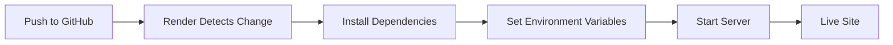

# Deployment Guide

## Local Development

```bash
# 1. Clone the repo
git clone https://github.com/CapstoneDesign-Spring2026-UlsanCollege/Free_Sewaa.git
cd Free_Sewaa

# 2. Install dependencies
npm install

# 3. Create .env file
echo "MONGODB_URI=mongodb://localhost:27017/freesewaa" > .env
echo "PORT=3000" >> .env

# 4. Start the server
npm start
```

The app runs at `http://localhost:3000`.

## Production Deployment (Render)



### Steps

1. Push code to GitHub `main` branch
2. In Render dashboard, connect the repository
3. Set build command: `npm install`
4. Set start command: `node server/server.js`
5. Add environment variables:
   - `MONGODB_URI` — MongoDB Atlas connection string
   - `PORT` — 10000 (Render's default)
6. Deploy

## Environment Variables

| Variable | Local | Production |
|----------|-------|------------|
| `PORT` | 3000 | 10000 (Render) |
| `MONGODB_URI` | mongodb://localhost:27017/freesewaa | MongoDB Atlas URI |
| `DB_NAME` | freesewaa | freesewaa |

## Production Checklist

- [ ] MongoDB Atlas cluster is running
- [ ] Environment variables are set in Render dashboard
- [ ] Admin credentials work on live site
- [ ] Signup and login work on live site
- [ ] Browse and donate pages load
- [ ] CORS allows the production domain

## Rollback Plan

1. Go to Render dashboard → Deploy History
2. Find the last working deployment
3. Click "Rollback" to that deployment
4. Verify the site works

---

*Last updated: May 2026*
