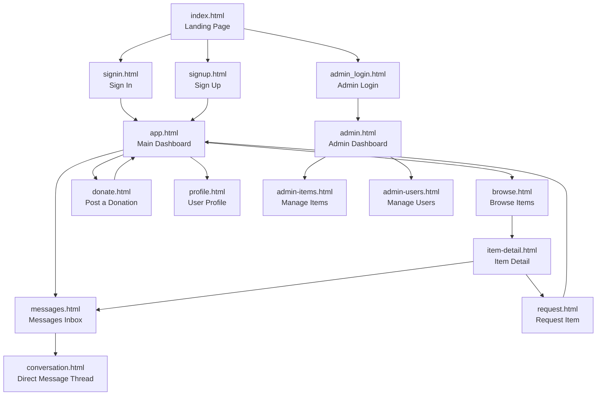

# UI Flow — Free Sewaa#

This document shows how the 18 pages of Free Sewaa connect and how users navigate through the platform.#

## Page Flow Diagram#

```mermaid
flowchart TD
    A["index.html<br/>Landing Page"] --> B["signin.html<br/>Sign In"]
    A --> C["signup.html<br/>Sign Up"]
    B --> D["app.html<br/>Main Dashboard"]
    C --> D

    D --> E["browse.html<br/>Browse Items"]
    D --> F["donate.html<br/>Post a Donation"]
    D --> G["profile.html<br/>User Profile"]
    D --> H["messages.html<br/>Messages Inbox"]

    E --> I["item-detail.html<br/>Item Detail"]
    I --> J["request.html<br/>Request Item"]
    I --> H
    J --> D
    F --> D

    H --> K["conversation.html<br/>Direct Message Thread"]

    A --> M["admin_login.html<br/>Admin Login"]
    M --> N["admin.html<br/>Admin Dashboard"]
    N --> O["admin-items.html<br/>Manage Items"]
    N --> P["admin-users.html<br/>Manage Users"]
```
*Last updated: May 2026*
