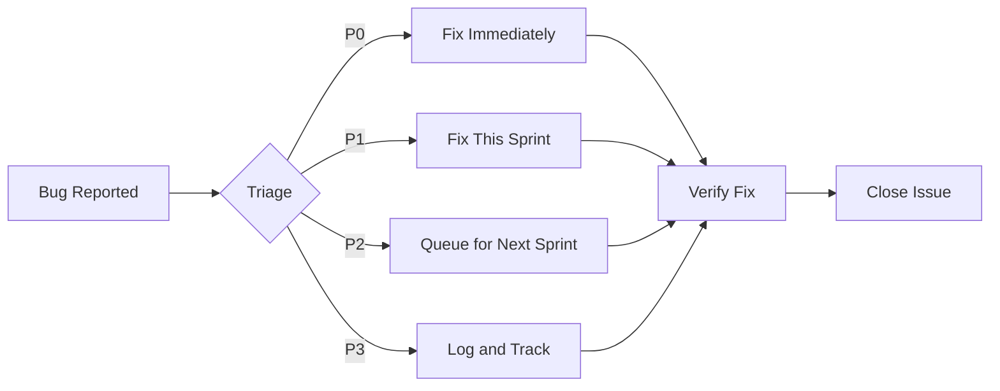

# Maintenance Plan

## Weekly Tasks

| Task | Frequency | Owner |
|------|-----------|-------|
| Check live site is accessible | Weekly | Any team member |
| Review new GitHub issues | Weekly | Project manager |
| Update documentation if needed | Weekly | Scribe |
| Run tests to verify nothing is broken | Weekly | QA lead |

## Database Backup

- MongoDB Atlas provides automated backups (if enabled)
- For local development, data is stored in MongoDB — no manual backup needed for demo

## Dependency Updates

Check for outdated packages monthly:

```bash
npm outdated
npm update
```

Key packages to monitor:
- `mongodb` driver — major version changes may require code updates
- `dotenv` — minor updates are safe
- `bcryptjs` — stable library, rare breaking changes

## Bug Triage Process



## Documentation Update Process

1. When a feature changes, update the relevant doc file
2. Keep the API reference in sync with route changes
3. Update the changelog for each release
4. Review all docs before major presentations

---

*Last updated: May 2026*
