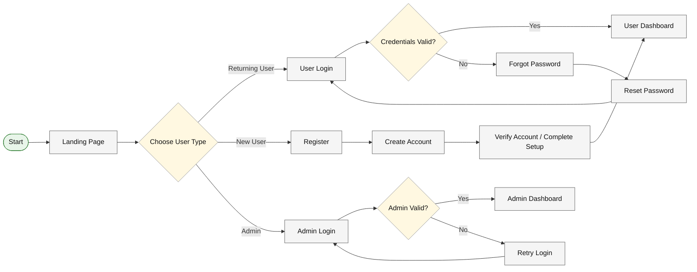
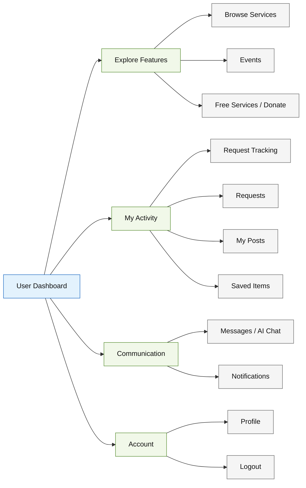
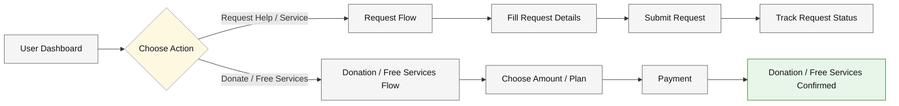
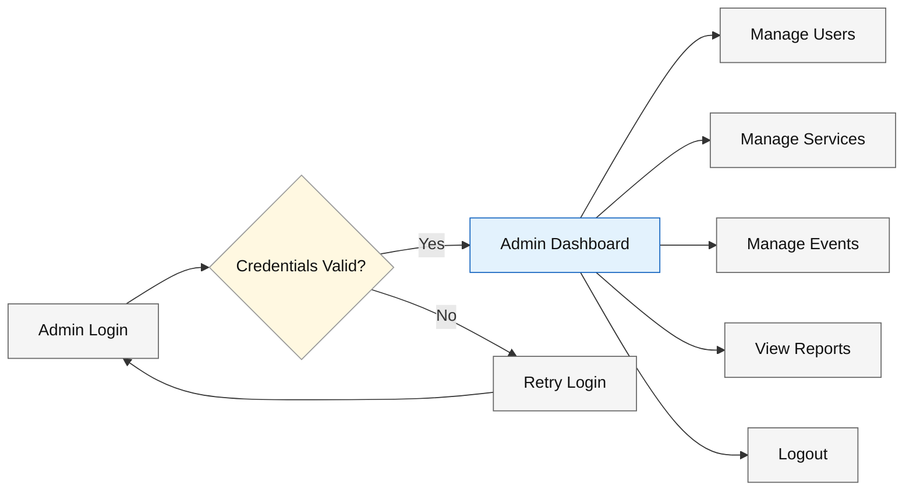
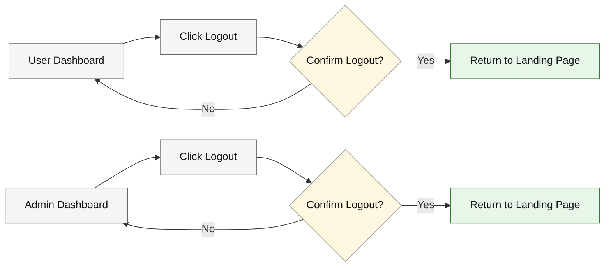

# Free Sewaa — User Flow Diagrams

This document explains the main user flow of the Free Sewaa project.  
The diagrams are divided by section so each part is easy to understand.

---

## 1. Authentication Flow

This diagram shows how a visitor enters the system as a returning user, new user, or admin.

---

## 2. User Dashboard Flow

This diagram shows the main areas a user can access after logging in.

---

## 3. Service Booking Flow

This diagram shows how a user moves from browsing a service to booking confirmation.

```mermaid
flowchart LR
    Dashboard[User Dashboard] --> Browse[Browse Services]
    Browse --> Details[View Service Details]
    Details --> Select[Select Service / Option]
    Select --> Booking[Enter Booking Details]
    Booking --> Payment[Payment]
    Payment --> Confirm[Booking Confirmation]
    Confirm --> RequestTracking[Saved in Request Tracking]

    classDef process fill:#f5f5f5,stroke:#666,color:#111;
    classDef important fill:#e8f5e9,stroke:#2e7d32,color:#111;

    class Dashboard,Browse,Details,Select,Booking,Payment process;
    class Confirm,RequestTracking important;
```

---

## 4. Donation / Request Flow

This diagram shows the main flow for requests and donation or free service actions.

---

## 5. Admin Flow

This diagram shows how an admin logs in and manages the system.

---

## 6. Logout Flow

This diagram shows the logout process for both users and admins.

---

## Summary

| Section | Purpose |
|---|---|
| Authentication Flow | Shows how new users, returning users, and admins enter the system |
| User Dashboard Flow | Shows the main features available after user login |
| Service Booking Flow | Shows how users browse and book services |
| Donation / Request Flow | Shows request, donation, and free-service-related actions |
| Admin Flow | Shows how admins manage the platform |
| Logout Flow | Shows how users and admins leave the system |

---

_Last updated: May 2026_
