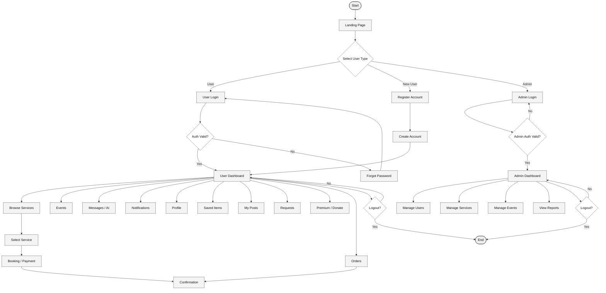

# Free Sewaa — Full User Flow Diagram

This is the complete user flow from start to end. It covers all three user paths: new user, returning user, and admin.

## Full Flowchart

## Breakdown by Section

| Section | File |
|---------|------|
| Authentication | [sections/01-authentication-flow.md](sections/01-authentication-flow.md) |
| User Dashboard | [sections/02-user-dashboard-flow.md](sections/02-user-dashboard-flow.md) |
| Service Booking | [sections/03-service-booking-flow.md](sections/03-service-booking-flow.md) |
| Donation / Request | [sections/04-donation-request-flow.md](sections/04-donation-request-flow.md) |
| Admin Panel | [sections/05-admin-flow.md](sections/05-admin-flow.md) |
| Logout | [sections/06-logout-flow.md](sections/06-logout-flow.md) |

---

*Last updated: May 2026*
