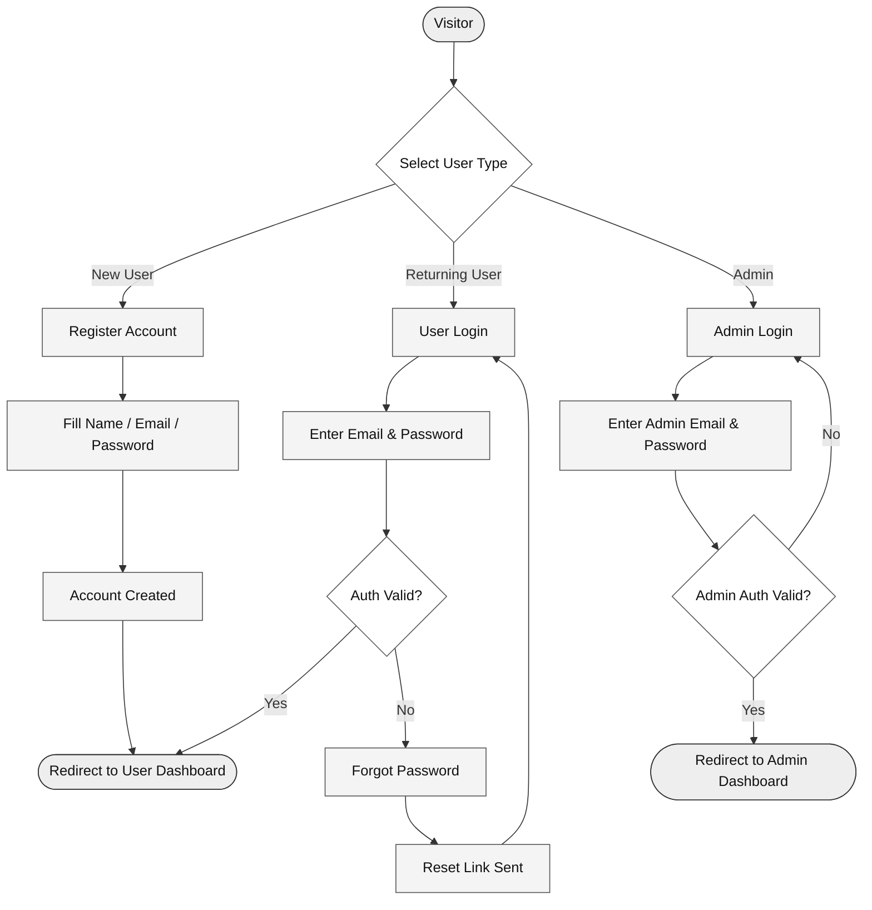

# Authentication Flow

How a user signs up, logs in, or resets their password. Also covers admin login.

## Diagram

## Steps

| Step | What Happens |
|------|--------------|
| Visitor arrives | User sees the landing page and picks their user type |
| New user | Fills signup form → account created → redirected to dashboard |
| Returning user | Enters email + password → system validates |
| Auth succeeds | Goes to user dashboard |
| Auth fails | Sees "forgot password" → reset link sent → tries again |
| Admin login | Separate login page → admin auth check → admin dashboard |

---

*Last updated: May 2026*
