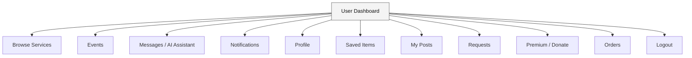

# User Dashboard Flow

All the features a user can access from their dashboard after logging in.

## Diagram

## Modules

| Module | Description |
|--------|-------------|
| Browse Services | View all donation items. Filter by category or search keyword. |
| Events | See upcoming community donation drives and events. |
| Messages / AI Assistant | Chat with other users or get help from the AI bot. |
| Notifications | Alerts for messages, requests, and order updates. |
| Profile | Edit name, email, profile picture, and password. |
| Saved Items | Items bookmarked for later. |
| My Posts | Items you posted. Edit or delete them. |
| Requests | People who requested your items. Accept or decline. |
| Premium / Donate | Upgrade account or donate to support the platform. |
| Orders | Items you successfully claimed. |

---

*Last updated: May 2026*
