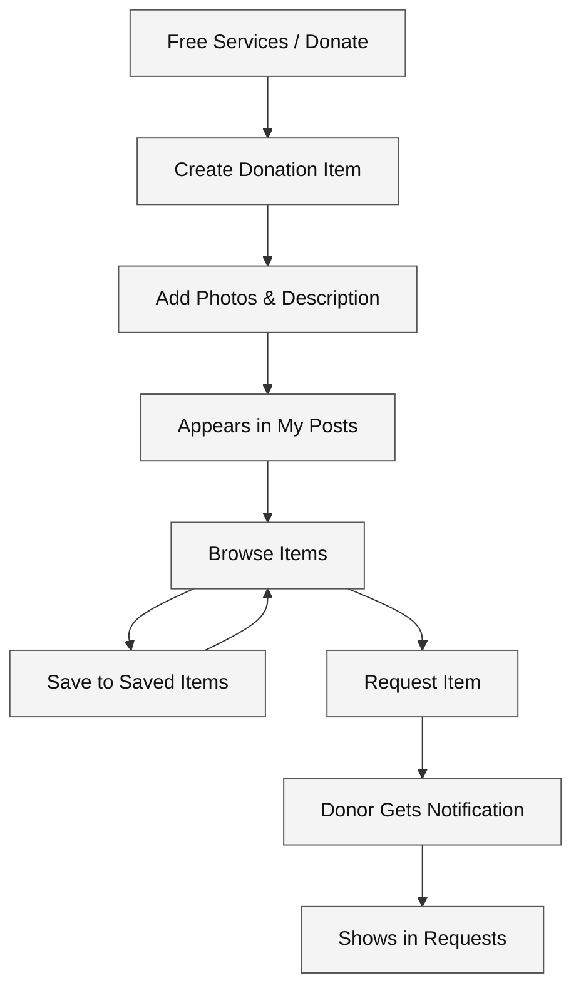

# Donation & Request Flow

How users create donation items, browse what is available, save items, and send requests.

## Diagram

## Steps

| Step | What Happens |
|------|--------------|
| Free Services / Donate | User accesses the donate section from the dashboard |
| Create Donation Item | User fills in item name, category, condition, and photos |
| My Posts | The item appears in the user's list of posted items |
| Browse Items | Other users can find the item by browsing or searching |
| Saved Items | Users can bookmark items to request later |
| Request Item | A user clicks "request" on an item |
| Requests | The original poster sees incoming requests and can accept/decline |

---

*Last updated: May 2026*
