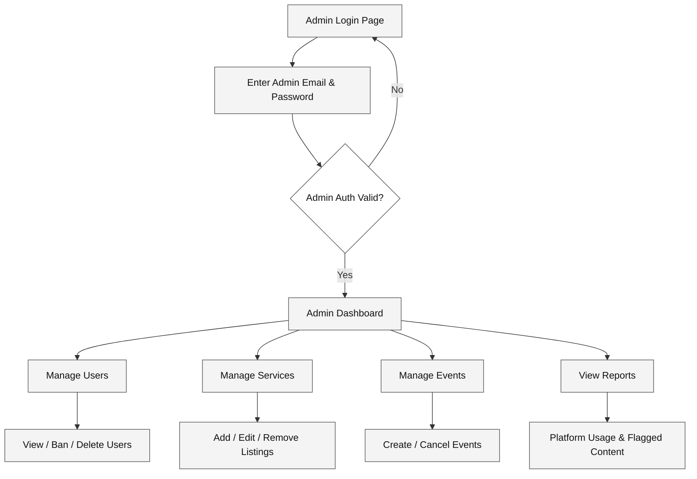

# Admin Flow

How an admin logs in and manages the platform.

## Diagram

## Steps

| Step | What Happens |
|------|--------------|
| Admin Login | Admin enters credentials on the admin login page |
| Auth check | System verifies admin role in the database |
| Wrong credentials | Redirected back to admin login to retry |
| Admin Dashboard | Main control panel with four management sections |
| Manage Users | View all users, ban suspicious accounts, or delete profiles |
| Manage Services | Add new donation categories, edit listings, remove inappropriate items |
| Manage Events | Schedule community events, update details, or cancel |
| View Reports | See platform statistics and review flagged content |

---

*Last updated: May 2026*
