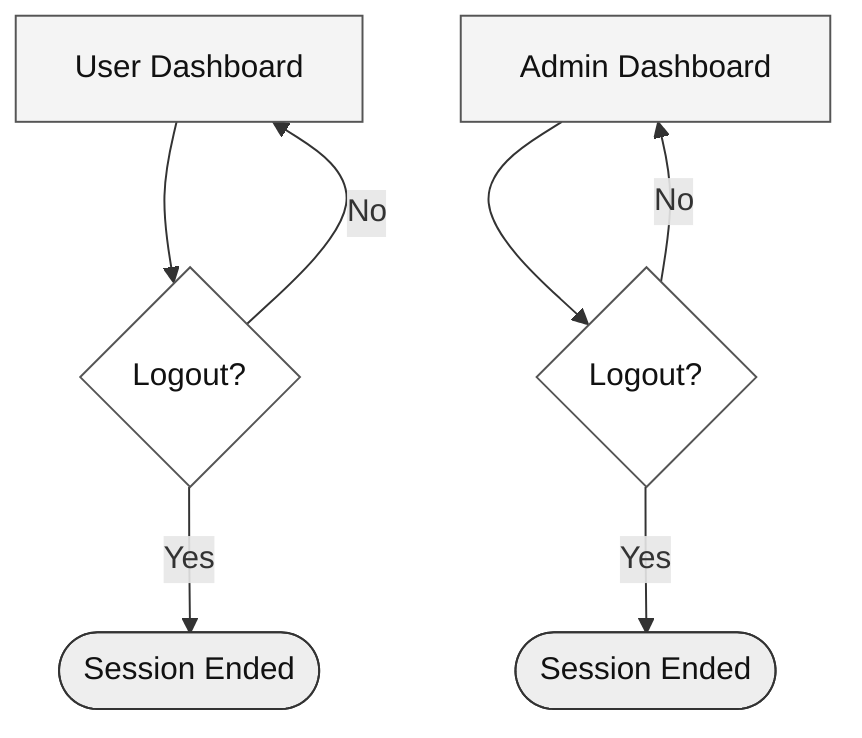

# Logout Flow

How both regular users and admins end their session.

## Diagram

## Steps

| Role | Stay | Logout |
|------|------|--------|
| Regular User | Stays on the dashboard and continues using features | Session clears → returns to landing page |
| Admin | Stays on the admin dashboard | Session clears → returns to landing page |

Both flows work the same way: the user clicks logout, the server destroys the session token, and the browser redirects to the homepage.

---

*Last updated: May 2026*
