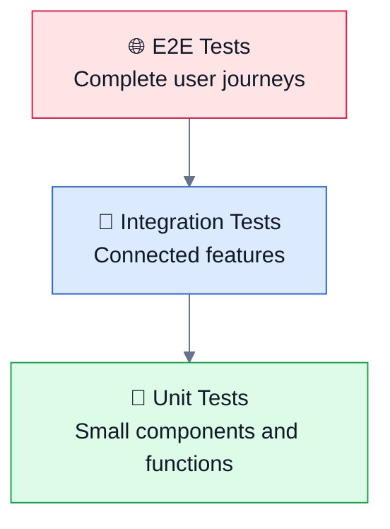
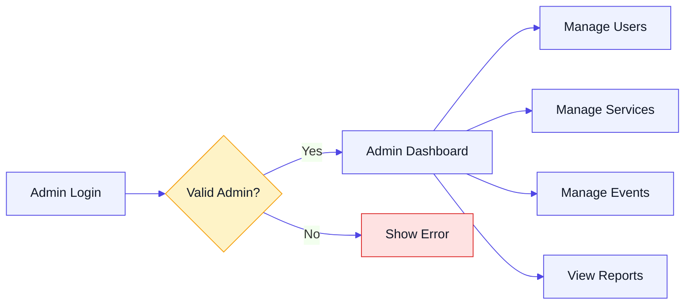

# 🧪 Free Sewaa — Professional Testing Plan

> A complete QA and testing strategy for **Free Sewaa**, covering functional testing, integration testing, E2E testing, security checks, performance checks, bug tracking, and release readiness.

---

## 📌 Document Information

| Item | Details |
|---|---|
| Project | Free Sewaa |
| Document Type | Testing Plan / QA Strategy |
| Status | Active |
| Last Updated | May 2026 |
| Purpose | To make sure Free Sewaa is stable, secure, user-friendly, and ready for demo/release |

---

## 🎯 Testing Goals

The main goal of this testing plan is to make sure Free Sewaa works correctly for:

- New users
- Returning users
- Admin users
- Service booking
- Requests
- Donation / premium features
- Dashboard navigation
- Messages / AI chat
- Notifications
- Profile and saved items
- Admin management features

---

## 🧭 QA Testing Flow

```mermaid
%%{init: {"theme": "base", "themeVariables": {
  "primaryColor": "#E8F5E9",
  "primaryTextColor": "#111827",
  "primaryBorderColor": "#2E7D32",
  "lineColor": "#2563EB",
  "secondaryColor": "#DBEAFE",
  "tertiaryColor": "#FEF3C7"
}}}%%
flowchart LR
    A([Start QA]) --> B[Check Requirements]
    B --> C[Run Unit Tests]
    C --> D[Run Integration Tests]
    D --> E[Run E2E Tests]
    E --> F[Manual UI Review]
    F --> G[Security Check]
    G --> H[Performance Check]
    H --> I{All Passed?}
    I -->|Yes| J([Ready for Demo / Release])
    I -->|No| K[Create Bug Report]
    K --> L[Fix Issue]
    L --> C

    classDef start fill:#DCFCE7,stroke:#16A34A,color:#111827;
    classDef process fill:#EFF6FF,stroke:#2563EB,color:#111827;
    classDef decision fill:#FEF3C7,stroke:#F59E0B,color:#111827;
    classDef danger fill:#FEE2E2,stroke:#DC2626,color:#111827;

    class A,J start;
    class B,C,D,E,F,G,H,L process;
    class I decision;
    class K danger;
```



---

## 🏗️ Testing Pyramid



| Test Level | Purpose | Priority |
|---|---|---|
| Unit Testing | Test small logic, components, and validation | High |
| Integration Testing | Test connected features working together | High |
| E2E Testing | Test complete user journeys | Critical |
| Manual QA | Check design, usability, responsiveness | Critical |
| Security Testing | Protect user/admin access and forms | Critical |
| Performance Testing | Ensure smooth loading and navigation | Medium |

---

# 1. ✅ Functional Testing

Functional testing checks whether each feature works as expected.

## 1.1 Authentication Testing

| Test ID | Test Case | Expected Result | Priority |
|---|---|---|---|
| AUTH-01 | New user registers with valid details | Account is created successfully | P0 |
| AUTH-02 | User logs in with valid credentials | User dashboard opens | P0 |
| AUTH-03 | User enters wrong password | Error message appears | P0 |
| AUTH-04 | User submits empty login form | Validation message appears | P1 |
| AUTH-05 | User uses forgot password option | Reset password flow starts | P1 |
| AUTH-06 | Admin logs in with valid credentials | Admin dashboard opens | P0 |
| AUTH-07 | Normal user tries admin login | Access is blocked | P0 |

---

## 1.2 User Dashboard Testing

| Test ID | Test Case | Expected Result | Priority |
|---|---|---|---|
| DASH-01 | User opens dashboard after login | Dashboard loads successfully | P0 |
| DASH-02 | User clicks Browse Services | Services page opens | P0 |
| DASH-03 | User clicks Events | Events page opens | P1 |
| DASH-04 | User clicks Messages / AI Chat | Messages page opens | P1 |
| DASH-05 | User clicks Notifications | Notifications page opens | P1 |
| DASH-06 | User clicks Profile | Profile page opens | P1 |
| DASH-07 | User clicks Saved Items | Saved items page opens | P2 |
| DASH-08 | User clicks My Posts | Posts page opens | P2 |
| DASH-09 | User clicks Requests | Requests page opens | P1 |
| DASH-10 | User clicks Premium / Donate | Premium or donation page opens | P1 |
| DASH-11 | User clicks Orders | Orders page opens | P1 |

---

## 1.3 Service Booking Testing

```mermaid
%%{init: {"theme": "base", "themeVariables": {
  "primaryColor": "#ECFDF5",
  "primaryBorderColor": "#10B981",
  "lineColor": "#0F766E"
}}}%%
flowchart LR
    A[Browse Services] --> B[View Service Details]
    B --> C[Select Service]
    C --> D[Enter Booking Details]
    D --> E[Payment / Confirmation]
    E --> F[Order Saved]

    classDef step fill:#F0FDFA,stroke:#0F766E,color:#111827;
    classDef success fill:#DCFCE7,stroke:#16A34A,color:#111827;

    class A,B,C,D,E step;
    class F success;
```



| Test ID | Test Case | Expected Result | Priority |
|---|---|---|---|
| BOOK-01 | User opens Browse Services | Service list appears | P0 |
| BOOK-02 | User selects a service | Service detail page opens | P0 |
| BOOK-03 | User enters booking details | Booking form accepts valid input | P0 |
| BOOK-04 | User leaves required fields empty | Validation message appears | P1 |
| BOOK-05 | User confirms booking | Confirmation message appears | P0 |
| BOOK-06 | User opens Orders | New booking appears in orders | P0 |

---

## 1.4 Request / Donation Testing

| Test ID | Test Case | Expected Result | Priority |
|---|---|---|---|
| REQ-01 | User opens Requests page | Request page loads | P1 |
| REQ-02 | User submits valid request | Request is created | P0 |
| REQ-03 | User submits empty request form | Validation error appears | P1 |
| DON-01 | User opens Premium / Donate page | Page loads correctly | P1 |
| DON-02 | User selects donation or premium option | Payment/confirmation flow starts | P1 |
| DON-03 | Donation/premium is completed | Success message appears | P1 |

---

## 1.5 Admin Testing



| Test ID | Test Case | Expected Result | Priority |
|---|---|---|---|
| ADM-01 | Admin logs in | Admin dashboard opens | P0 |
| ADM-02 | Admin manages users | User management page works | P0 |
| ADM-03 | Admin manages services | Service management page works | P0 |
| ADM-04 | Admin manages events | Event management page works | P1 |
| ADM-05 | Admin views reports | Reports page loads | P1 |
| ADM-06 | Non-admin accesses admin page | Access is blocked | P0 |

---

# 2. 🔗 Integration Testing

Integration testing checks that connected features work together.

## 2.1 User Authentication Integration

| Flow | Expected Result |
|---|---|
| Register → Login → Dashboard | New user can create account and access dashboard |
| Login → Forgot Password → Login | User can recover and retry login |
| Login → Dashboard → Logout | User session ends correctly |

---

## 2.2 Booking Integration

| Flow | Expected Result |
|---|---|
| Browse Services → Service Details | Correct service data appears |
| Service Details → Booking | Booking form opens with selected service |
| Booking → Confirmation | Booking confirmation appears |
| Confirmation → Orders | Order is saved and visible |

---

## 2.3 Admin Integration

| Flow | Expected Result |
|---|---|
| Admin Login → Admin Dashboard | Admin dashboard opens |
| Admin Dashboard → Manage Users | User list/actions work |
| Admin Dashboard → Manage Services | Service list/actions work |
| Admin Dashboard → Reports | Reports are visible |

---

# 3. 🌐 End-to-End Testing

E2E testing checks the app like a real user.

## E2E-01: New User Journey

| Step | Action | Expected Result |
|---|---|---|
| 1 | Open landing page | Landing page loads |
| 2 | Choose New User | Register page opens |
| 3 | Create account | Account is created |
| 4 | Login | User dashboard opens |
| 5 | Browse services | Service list appears |
| 6 | Book service | Booking confirmation appears |
| 7 | Open Orders | Booking is visible |
| 8 | Logout | User returns to landing/login page |

---

## E2E-02: Returning User Journey

| Step | Action | Expected Result |
|---|---|---|
| 1 | Open login page | Login form appears |
| 2 | Enter valid credentials | Login succeeds |
| 3 | Open dashboard | Dashboard appears |
| 4 | Open profile | Profile page loads |
| 5 | Open notifications | Notifications page loads |
| 6 | Logout | Session ends |

---

## E2E-03: Admin Journey

| Step | Action | Expected Result |
|---|---|---|
| 1 | Open admin login | Admin login form appears |
| 2 | Enter admin credentials | Admin dashboard opens |
| 3 | Manage users | User management works |
| 4 | Manage services | Service management works |
| 5 | Manage events | Event management works |
| 6 | View reports | Reports page loads |
| 7 | Logout | Admin session ends |

---

# 4. 🔐 Security Testing

Security testing checks that user and admin data is protected.

| Test ID | Security Check | Expected Result | Priority |
|---|---|---|---|
| SEC-01 | Open dashboard without login | Redirect to login | P0 |
| SEC-02 | Open admin dashboard as normal user | Access blocked | P0 |
| SEC-03 | Submit script tags in form | Script does not execute | P0 |
| SEC-04 | Submit empty required fields | Validation appears | P1 |
| SEC-05 | Logout and press browser back | Protected page does not open | P0 |
| SEC-06 | Use invalid admin session | Admin access is blocked | P0 |
| SEC-07 | Enter very long text in inputs | App does not crash | P1 |

---

# 5. ⚡ Performance Testing

Performance testing checks if the app runs smoothly.

## Pages to Check

| Page | Performance Goal |
|---|---|
| Landing Page | Loads quickly |
| Login/Register | Form appears without delay |
| User Dashboard | Cards and menu load smoothly |
| Browse Services | Service list loads correctly |
| Orders | Order data loads smoothly |
| Admin Dashboard | Admin data loads without freezing |

## Performance Checklist

- [ ] No unnecessary console errors
- [ ] No broken images
- [ ] Images are optimized
- [ ] Pages load smoothly on mobile
- [ ] Pages load smoothly on desktop
- [ ] Dashboard does not freeze
- [ ] Forms submit without long delay
- [ ] Large lists do not break the layout

---

# 6. 📱 Responsive UI Testing

| Device Type | What to Check |
|---|---|
| Mobile | Layout stacks correctly, buttons are easy to tap |
| Tablet | Cards and sections align properly |
| Desktop | Full layout looks clean and balanced |
| Small screen | No horizontal overflow |
| Large screen | Content does not look too stretched |

## Responsive Checklist

- [ ] Navigation works on mobile
- [ ] Buttons are not too small
- [ ] Text is readable
- [ ] Cards are aligned
- [ ] Forms fit screen width
- [ ] No content is cut off
- [ ] No horizontal scrolling issue

---

# 7. 🧑‍💻 Manual QA Checklist

## General UI

- [ ] App opens without error
- [ ] Navigation works correctly
- [ ] Text is readable
- [ ] Buttons are clear
- [ ] Forms are aligned
- [ ] No broken links
- [ ] No broken images
- [ ] No console errors
- [ ] Mobile layout is clean
- [ ] Desktop layout is clean

## Authentication

- [ ] New user can register
- [ ] Returning user can login
- [ ] Wrong login shows error
- [ ] Forgot password option is visible
- [ ] Admin can login
- [ ] Logout works

## User Features

- [ ] Dashboard opens after login
- [ ] Browse services works
- [ ] Events page works
- [ ] Messages / AI chat works
- [ ] Notifications page works
- [ ] Profile page works
- [ ] Saved items page works
- [ ] My posts page works
- [ ] Requests page works
- [ ] Premium / Donate page works
- [ ] Orders page works

## Admin Features

- [ ] Admin dashboard opens
- [ ] Manage users works
- [ ] Manage services works
- [ ] Manage events works
- [ ] Reports page works
- [ ] Admin logout works

---

# 8. 🐞 Bug Reporting Standard

Use this format for every bug.

```markdown
## Bug Title

**Priority:** P0 / P1 / P2 / P3  
**Status:** Open / In Progress / Fixed / Closed  
**Page/Feature:**  
**Device/Browser:**  
**Reported By:**  
**Date:**  

### Description
Explain the issue clearly.

### Steps to Reproduce
1. Go to ...
2. Click ...
3. Enter ...
4. See error ...

### Expected Result
Explain what should happen.

### Actual Result
Explain what actually happened.

### Screenshot / Evidence
Attach screenshot or screen recording.

### Notes
Add extra information if needed.
```

---

# 9. 🚨 Bug Priority Levels

| Priority | Meaning | Example |
|---|---|---|
| P0 | Critical blocker | App does not open, login broken |
| P1 | Major issue | Booking, admin, or dashboard broken |
| P2 | Medium issue | Feature works but has visible problem |
| P3 | Minor issue | Typo, small spacing issue, color mismatch |

---

# 10. ✅ Release Readiness Checklist

Free Sewaa is ready for demo/release only when:

- [ ] Project builds successfully
- [ ] No P0 bugs remain
- [ ] P1 bugs are fixed or documented
- [ ] Login/register works
- [ ] User dashboard works
- [ ] Service booking works
- [ ] Orders page works
- [ ] Request/donation flow works
- [ ] Admin dashboard works
- [ ] Logout works
- [ ] Mobile UI is clean
- [ ] Desktop UI is clean
- [ ] README/docs are updated
- [ ] Testing plan is updated
- [ ] Final manual QA is completed

---

## 🏁 Final QA Status

| Category | Status |
|---|---|
| Functional Testing | ⬜ Not Started / 🟡 In Progress / 🟢 Passed |
| Integration Testing | ⬜ Not Started / 🟡 In Progress / 🟢 Passed |
| E2E Testing | ⬜ Not Started / 🟡 In Progress / 🟢 Passed |
| Security Testing | ⬜ Not Started / 🟡 In Progress / 🟢 Passed |
| Performance Testing | ⬜ Not Started / 🟡 In Progress / 🟢 Passed |
| Manual QA | ⬜ Not Started / 🟡 In Progress / 🟢 Passed |

---

## 📦 Suggested Commands

Use the commands that exist in the project.

```bash
npm install
npm run dev
npm run build
npm run lint
npm run test
```

If a command does not exist yet, add it later in `package.json`.

---

## 📝 Summary

This testing plan helps the Free Sewaa team test the project in a clear and organized way.  
It covers the most important user flows, admin flows, security checks, UI checks, and release requirements.

A release should only be accepted when the main flows are working, the UI is responsive, and all critical bugs are fixed.

---

_Last updated: May 2026_
