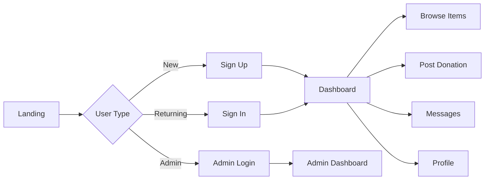

# Free Sewaa — Documentation Hub

> Community donation platform connecting donors with people who need reusable items.

**Live site:** [free-sewaa-qh05.onrender.com](https://free-sewaa-qh05.onrender.com)

---

## Quick Links

| Section | Documents |
|---------|-----------|
| **Project Info** | [Overview](PROJECT_OVERVIEW.md) · [Requirements](PRODUCT_REQUIREMENTS.md) · [User Personas](USER_PERSONAS.md) · [User Stories](USER_STORIES.md) · [Glossary](GLOSSARY.md) |
| **Architecture** | [System Architecture](SYSTEM_ARCHITECTURE.md) · [Database Design](DATABASE_DESIGN.md) · [API Reference](API_REFERENCE.md) · [Authentication](AUTHENTICATION.md) |
| **Guides** | [Frontend](FRONTEND_GUIDE.md) · [Backend](BACKEND_GUIDE.md) · [Environment Setup](ENVIRONMENT_SETUP.md) · [Deployment](DEPLOYMENT_GUIDE.md) · [Admin](ADMIN_GUIDE.md) |
| **User Flows** | [User Flow Diagrams](USER_FLOW.md) |
| **Testing & Audits** | [Testing Plan](TESTING_PLAN.md) · [QA Checklist](QA_CHECKLIST.md) · [Project Audit Checklist](AUDIT_CHECKLIST.md) |
| **Management** | [Roadmap](ROADMAP.md) · [Future Enhancements](FUTURE_ENHANCEMENTS.md) · [Risk Management](RISK_MANAGEMENT.md) · [Maintenance Plan](MAINTENANCE_PLAN.md) |
| **Release** | [Release Notes](RELEASE_NOTES.md) · [Demo Guide](DEMO_GUIDE.md) · [Security Plan](SECURITY_PLAN.md) |
| **Decisions** | [ADR-001: Technology Stack](adr/001-technology-stack.md) · [ADR-002: Authentication](adr/002-authentication-choice.md) · [ADR-003: Database](adr/003-database-choice.md) |
| **Troubleshooting** | [Common Issues](TROUBLESHOOTING.md) |

---

## Project Status

| Status | Detail |
|--------|--------|
| Phase | Final sprint — QA and documentation |
| Deployment | Live on Render |
| Test Status | 3/3 Jest tests passing |
| Docs Coverage | 26+ documents |

---

## Main User Flow

---

## Team

Capstone Design — Spring 2026, Ulsan College.

| Role | Name |
|------|------|
| Project Manager | Ram Pathak |
| Lead Developer | Sujan Tamang |
| Demo Driver | Mohan Khadka |
| QA Lead | Sujan Shrestha |
| Scribe | Swarnim Jung Karki |

---

*Last updated: May 2026*
