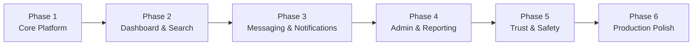

# Roadmap

> **Final capstone status (June 2026):** Phases 1–4 represent the submitted semester MVP. The remaining trust, safety, and production-polish items are deferred post-capstone work rather than active semester commitments.

## Development Phases

## Phase 1: Core Platform ✅ Complete

- [x] User signup and login
- [x] Browse donation items
- [x] Post donation items
- [x] Request items
- [x] Basic styling and navigation

## Phase 2: Dashboard & Search ✅ Complete

- [x] User dashboard
- [x] Category filtering
- [x] Profile page
- [x] Saved items
- [x] My posts

## Phase 3: Messaging & Notifications ✅ Complete

- [x] Direct messaging between users
- [x] Conversation history
- [x] Notification system
- [x] AI chatbot (basic)

## Phase 4: Admin & Reporting ✅ Complete

- [x] Admin login
- [x] Admin dashboard
- [x] User management (block/unblock/delete)
- [x] Listing management (remove/restore)
- [x] Platform overview statistics

## Phase 5: Trust & Safety — Deferred After Capstone

- [ ] Password hashing with bcrypt
- [ ] Rate limiting on auth
- [ ] Email verification
- [ ] User reporting system
- [ ] Content moderation tools

## Phase 6: Production Polish — Future Work

- [ ] Expanded test coverage
- [ ] Performance optimization
- [ ] Accessibility improvements
- [ ] Multi-language support
- [ ] Dark mode refinements

---

*Last updated: June 2026*
