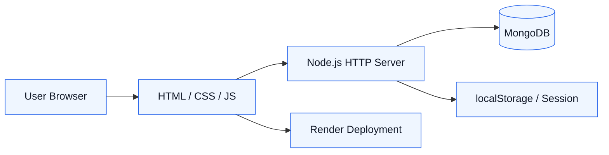
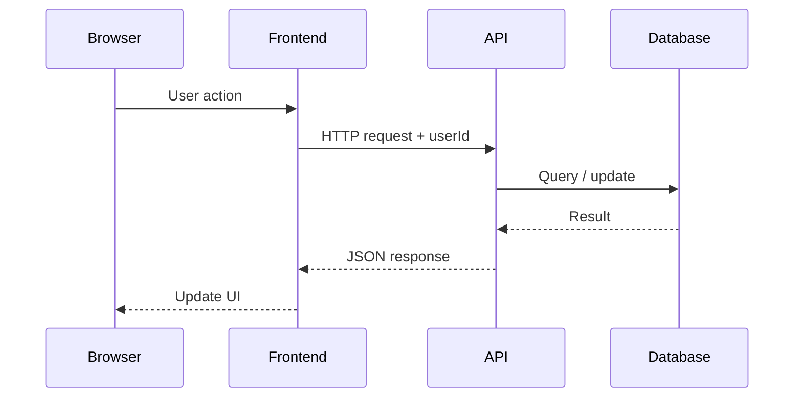

# System Architecture

## High-Level Architecture

## Layers

### Frontend Layer
- Vanilla HTML5, CSS3, JavaScript (no frameworks)
- 28+ HTML pages covering all user flows
- Responsive design with CSS media queries
- localStorage for auth state and user preferences
- Canvas-based particle animation on most pages

### Backend API Layer
- Custom Node.js HTTP server (no Express)
- Routes: auth, listings, requests, messages, admin, notifications
- JSON request/response format
- CORS enabled for frontend access
- File serving for static assets

### Database Layer
- MongoDB with native driver
- 10 collections: users, listings, requests, conversations, messages, notifications, suggestions, reviews, states, meta
- Indexes on frequently queried fields

### Authentication Layer
- localStorage-based auth with userId stored in browser
- Password comparison (plaintext — bcryptjs available for future use)
- Admin role check via database field
- Firebase token support for phone/email auth

### Deployment Layer
- Hosted on Render
- MongoDB Atlas for production database
- GitHub Actions CI for automated testing

## Request/Response Flow

---

*Last updated: May 2026*
