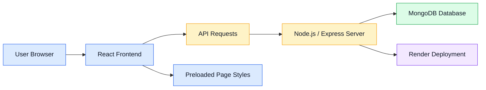
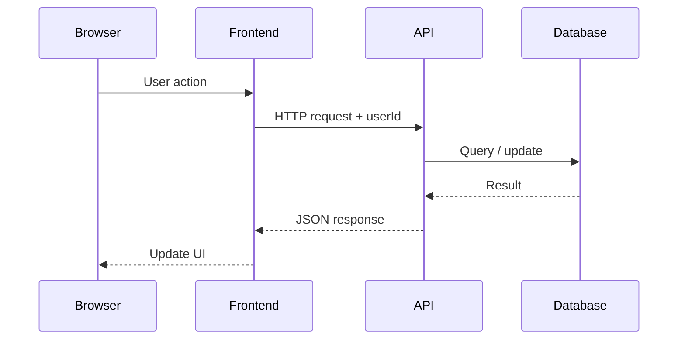

# System Architecture

## High-Level Architecture

## Layers

### Frontend Layer
- React 19 with JSX components
- Built with Vite + `@vitejs/plugin-react`
- 24+ generated page components covering all user flows
- Shared styles and reusable component patterns
- Preloaded page styles for faster navigation
- Vite dev server on port 5173 with API proxy to backend
- Production build outputs to `dist/`

### Backend API Layer
- Custom Node.js HTTP server
- Routes: auth, listings, requests, messages, admin, notifications
- JSON request/response format
- CORS enabled for frontend access
- Serves both static files (HTML/CSS/JS) and built React assets from `dist/`

### Database Layer
- MongoDB with native driver
- 10 collections: users, listings, requests, conversations, messages, notifications, suggestions, reviews, states, meta
- Indexes on frequently queried fields

### Authentication Layer
- localStorage-based auth with userId stored in browser
- Password comparison (plaintext — bcryptjs available for future use)
- Admin role check via database field
- Firebase token support for phone/email auth

### Deployment Layer
- Hosted on Render
- Build command: `npm ci && npm run build`
- Start command: `node server/server.js`
- MongoDB Atlas for production database
- GitHub Actions CI for automated testing

## Request/Response Flow

---

*Last updated: May 2026*
