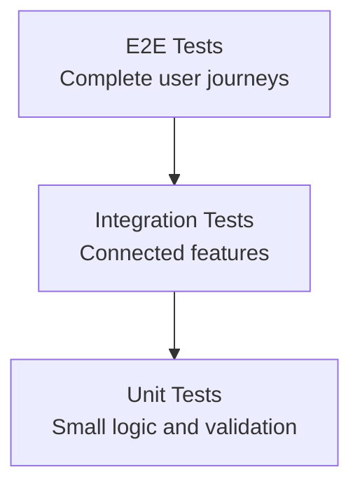

# Testing Plan

## Testing Levels



| Level | Purpose | Status |
|-------|---------|--------|
| Unit | Test validation, small functions | Partial |
| Integration | Test connected features | Planned |
| E2E | Test full user journeys | Planned |
| Manual QA | Visual and usability checks | Ongoing |

## Unit Tests

**Framework:** Jest + Supertest

**Current tests (3 passing):**
- Health endpoint returns 200
- Signup rejects missing firstName
- Signup rejects weak password

**To add:**
- User signup with valid data
- User login with valid/invalid credentials
- Admin login
- Listing CRUD operations
- Request creation and status updates
- Message sending
- Notification creation

## Integration Tests

- Auth flow: signup → login → session check → logout
- Listing flow: create → read → update → delete
- Request flow: create request → accept → complete
- Admin flow: admin login → manage users → manage listings

## E2E Test Script

1. Open landing page
2. Sign up as a new user
3. Browse available items
4. Post a donation item
5. Request an item
6. Send a message
7. Log in as admin
8. Manage users and listings
9. Log out

## Running Tests

```bash
cd server
npm install
npm test
```

## Test Status

| Category | Tests | Status |
|----------|-------|--------|
| Health check | 1 | ✅ Passing |
| Auth validation | 2 | ✅ Passing |
| Auth functional | 0 | ❌ Not started |
| Listings | 0 | ❌ Not started |
| Requests | 0 | ❌ Not started |
| Messages | 0 | ❌ Not started |
| Admin | 0 | ❌ Not started |

---

*Last updated: May 2026*
