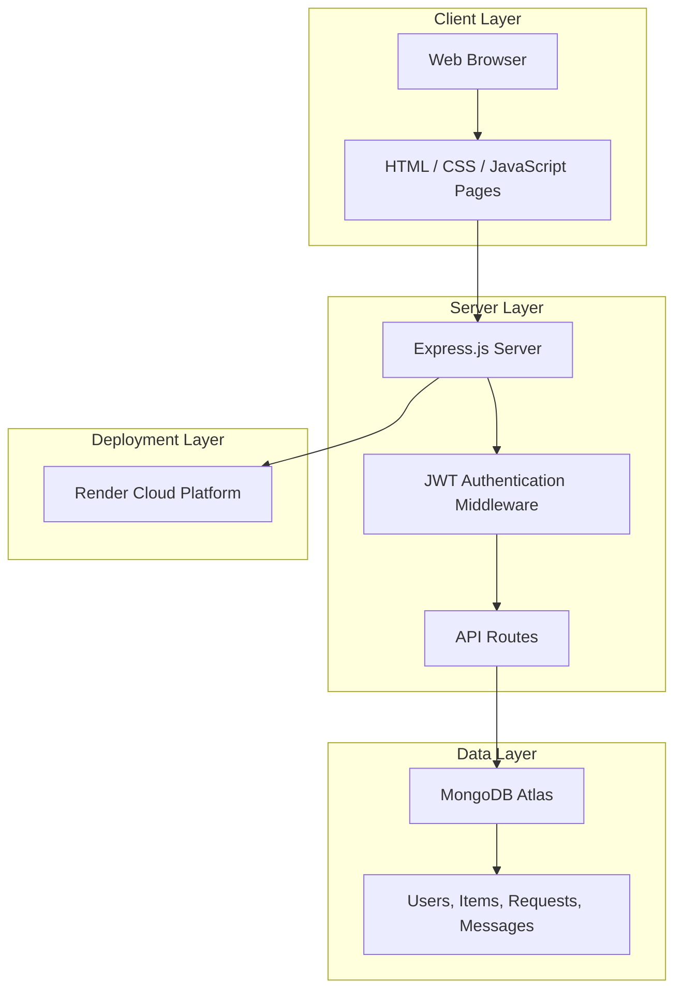
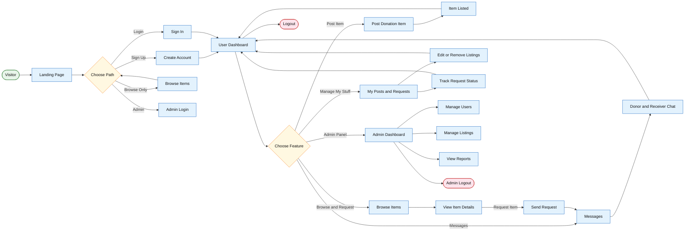
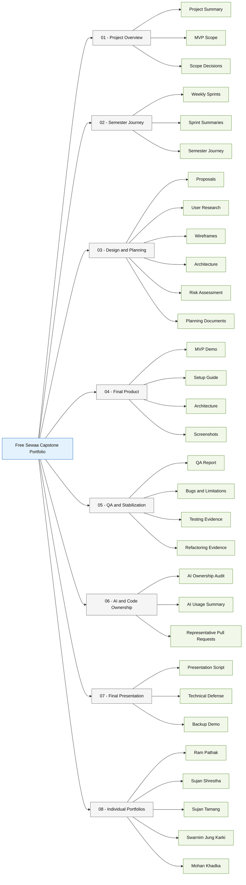
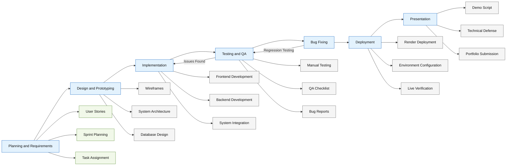

# UML and Mermaid Diagrams

> This document provides visual diagrams for the Free Sewaa platform, covering system architecture, user flow, team contribution, portfolio structure, and development workflow.

---

## Table of Contents

* [1. System Architecture Diagram](#1-system-architecture-diagram)
* [2. User Flow Diagram](#2-user-flow-diagram)
* [3. Team Contribution Diagram](#3-team-contribution-diagram)
* [4. Portfolio Structure Diagram](#4-portfolio-structure-diagram)
* [5. Development Workflow Diagram](#5-development-workflow-diagram)
* [6. Existing UML Diagrams](#6-existing-uml-diagrams)
* [Navigation](#navigation)

---

## 1. System Architecture Diagram

---

## 2. User Flow Diagram

---

## 3. Team Contribution Diagram

```mermaid
flowchart TD
    A["Free Sewaa Team Portfolio"]

    A --> B["Ram Pathak - Backend and Core Logic"]
    A --> C["Sujan Shrestha - Project Lead, Frontend, Documentation and Testing"]
    A --> D["Sujan Tamang - Testing, Integration and Documentation"]
    A --> E["Swarnim Jung Karki - Styling, CSS and Documentation"]
    A --> F["Mohan Khadka - Bug Fixes and Maintenance"]

    B --> B1["API Routes"]
    B --> B2["Database Integration"]
    B --> B3["Authentication System"]

    C --> C1["Project Management"]
    C --> C2["Frontend Development"]
    C --> C3["Documentation Management"]
    C --> C4["System Testing"]
    C --> C5["UI Improvements"]
    C --> C6["Portfolio Development"]

    D --> D1["Testing Evidence"]
    D --> D2["Integration Checks"]
    D --> D3["Documentation Support"]

    E --> E1["Responsive Design"]
    E --> E2["CSS Styling"]
    E --> E3["Portfolio Organization"]

    F --> F1["Bug Fixing"]
    F --> F2["System Stability"]
    F --> F3["Final Cleanup"]
```

---

## 4. Portfolio Structure Diagram

---

## 5. Development Workflow Diagram

---

## 6. Existing UML Diagrams

| Diagram              | Description                                                 |
| -------------------- | ----------------------------------------------------------- |
| Authentication Flow  | User registration, login, password recovery and admin login |
| Dashboard Flow       | User dashboard interactions                                 |
| Donation Flow        | Create, browse, request and manage donations                |
| Messaging Flow       | Communication between donors and receivers                  |
| Admin Flow           | User management and platform moderation                     |
| Logout Flow          | User and admin logout process                               |
| Complete UML Diagram | Full system workflow                                        |

---

## Navigation

* [Back to Documentation Home](./README.md)
* [Back to Repository Root](../README.md)
* [Back to Portfolio Home](../portfolio/README.md)
* [View Individual Portfolios](../portfolio/08-individual-portfolios/README.md)

---

**Free Sewaa — Capstone Design Project**
**Ulsan College, Spring 2026**

### Debug Fixes Applied

* Fixed Mermaid parse error in User Flow Diagram.
* Replaced `classDef end` with `classDef endNode`.
* Removed special characters that can break GitHub Mermaid rendering.
* Replaced `&` with `and`.
* Removed ` ` from diagrams where it may cause rendering issues.
* Removed semicolons from `classDef` lines for better compatibility.
