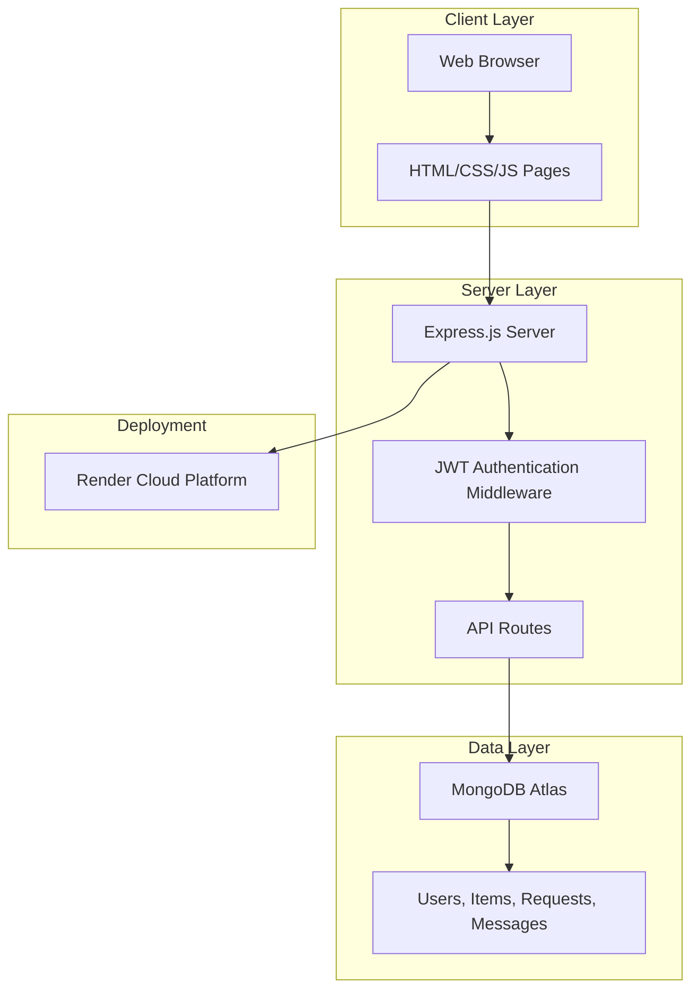
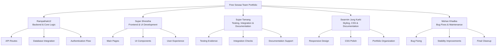
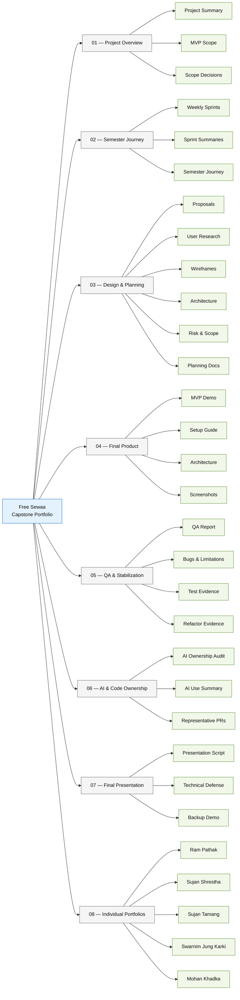
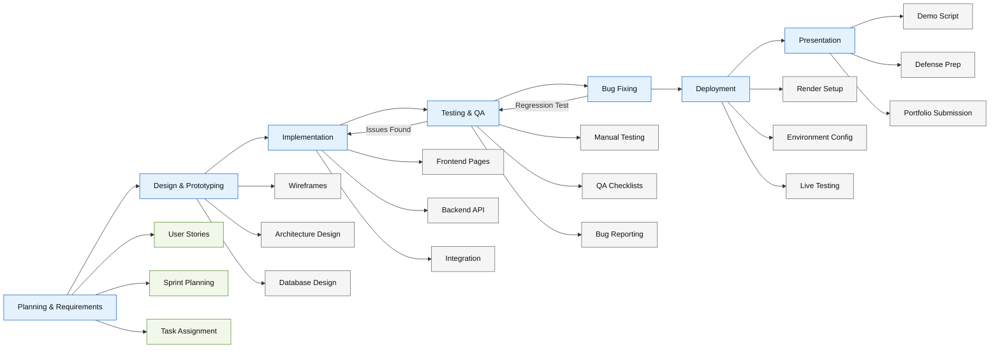

# UML and Mermaid Diagrams

> This document provides visual diagrams for the Free Sewaa platform, covering system architecture, user flow, team contribution, portfolio structure, and development workflow. These diagrams complement the detailed documentation in the repository.

---

## Table of Contents

- [1. System Architecture Diagram](#1-system-architecture-diagram)
- [2. User Flow Diagram](#2-user-flow-diagram)
- [3. Team Contribution Diagram](#3-team-contribution-diagram)
- [4. Portfolio Structure Diagram](#4-portfolio-structure-diagram)
- [5. Development Workflow Diagram](#5-development-workflow-diagram)
- [6. Existing UML Diagrams](#6-existing-uml-diagrams)
- [Navigation](#navigation)

---

## 1. System Architecture Diagram

This diagram shows the high-level architecture of the Free Sewaa platform, including the frontend, backend, database, and deployment layers.



---

## 2. User Flow Diagram

This diagram shows the complete user journey — from landing on the platform through authentication, core feature usage, and logout. For a more detailed breakdown with six separate flow diagrams, see [Project UML Diagrams](./Project_UML%20diagram/USER_FLOW_DIAGRAM.md).

```mermaid
flowchart LR
    Start([Visitor]) --> Landing[Landing Page]
    Landing --> Auth{Choose Action}

    Auth -->|Sign Up| Register[Create Account]
    Auth -->|Login| Login[Sign In]
    Auth -->|Browse Only| Browse[Browse Items]

    Register --> UserDash[User Dashboard]
    Login --> UserDash

    UserDash --> Actions{Choose Feature}
    Actions -->|Post Item| Donate[Donate Page]
    Actions -->|Find Items| Browse2[Browse Items]
    Actions -->|Request| Request[Request Item]
    Actions -->|Chat| Messages[Messages]
    Actions -->|Manage| Dashboard[Dashboard]

    Donate --> Confirm[Item Posted]
    Browse2 --> Request
    Request --> Messages
    Messages --> Confirm2[Communication Complete]
    Dashboard --> Manage[Manage Posts & Requests]

    Manage --> Logout([Logout])

    classDef start fill:#e8f5e9,stroke:#2e7d32,color:#111;
    classDef page fill:#e3f2fd,stroke:#1565c0,color:#111;
    classDef action fill:#fff8e1,stroke:#f57f17,color:#111;
    classDef end fill:#fce4ec,stroke:#c62828,color:#111;

    class Start start;
    class Landing,Register,Login,Browse,UserDash,Donate,Browse2,Request,Messages,Dashboard,Manage page;
    class Auth,Actions action;
    class Confirm,Confirm2,Logout end;
```
---

## 3. Team Contribution Diagram

This diagram maps each team member's role and their primary technical contributions to the Free Sewaa platform.



---

## 4. Portfolio Structure Diagram

This diagram shows the organization of the final capstone portfolio across all 8 sections.



---

## 5. Development Workflow Diagram

This diagram shows the development process followed during the capstone project — from planning through deployment and presentation.



---

## 6. Existing UML Diagrams

The repository also contains detailed UML user flow diagrams in the [Project UML Diagram](./Project_UML%20diagram/) directory. These include:

| Diagram | File | Description |
|---------|------|-------------|
| Full User Flow | [USER_FLOW_DIAGRAM.md](./Project_UML%20diagram/USER_FLOW_DIAGRAM.md) | Complete user journey with 6 section diagrams |
| Raw Mermaid Source | [user-flow.mmd](./Project_UML%20diagram/user-flow.mmd) | Raw Mermaid code for all flows |
| Authentication Flow | [sections/01-authentication-flow.md](./Project_UML%20diagram/sections/01-authentication-flow.md) | Login, register, forgot password, admin login |
| User Dashboard Flow | [sections/02-user-dashboard-flow.md](./Project_UML%20diagram/sections/02-user-dashboard-flow.md) | All dashboard features |
| Service Booking Flow | [sections/03-service-booking-flow.md](./Project_UML%20diagram/sections/03-service-booking-flow.md) | Browse, select, book, confirm |
| Donation/Request Flow | [sections/04-donation-request-flow.md](./Project_UML%20diagram/sections/04-donation-request-flow.md) | Create, post, browse, save, request |
| Admin Flow | [sections/05-admin-flow.md](./Project_UML%20diagram/sections/05-admin-flow.md) | Admin auth, dashboard, management |
| Logout Flow | [sections/06-logout-flow.md](./Project_UML%20diagram/sections/06-logout-flow.md) | User and admin logout |
| UML Image | [UML Diagram .jpeg](./Project_UML%20diagram/UML%20Diagram%20.jpeg) | Original UML diagram image |

---

## Navigation

- [Back to Documentation Home](./README.md)
- [Back to Repository Root](../README.md)
- [Back to Portfolio Home](../portfolio/README.md)
- [View Individual Portfolios](../portfolio/08-individual-portfolios/README.md)

---

*Free Sewaa — Capstone Design, Spring 2026, Ulsan College*
