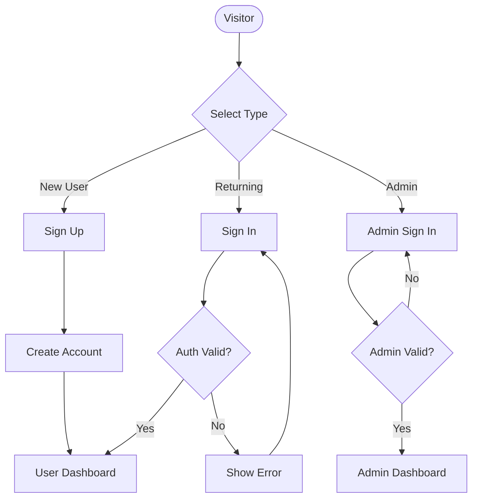
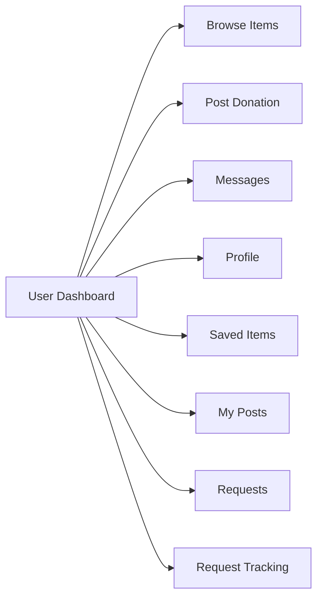
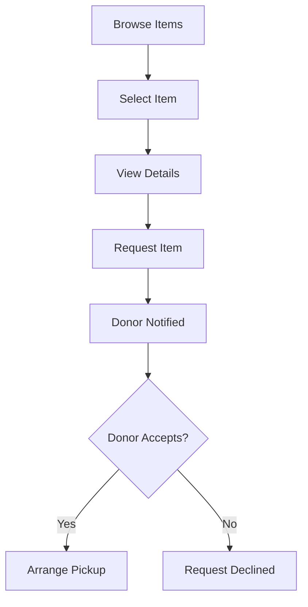
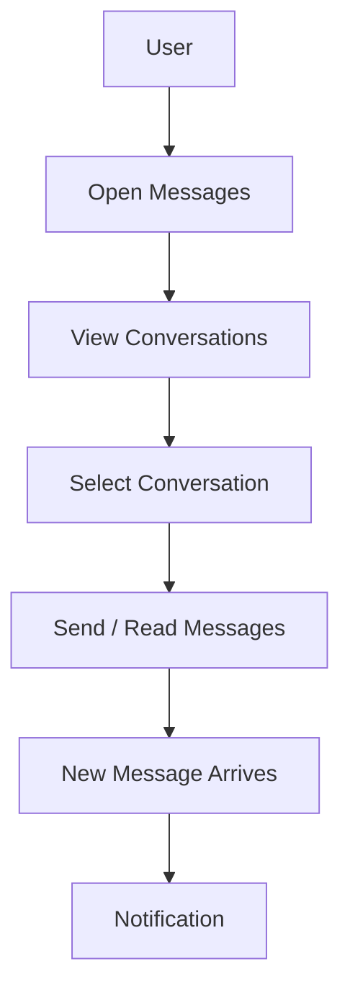
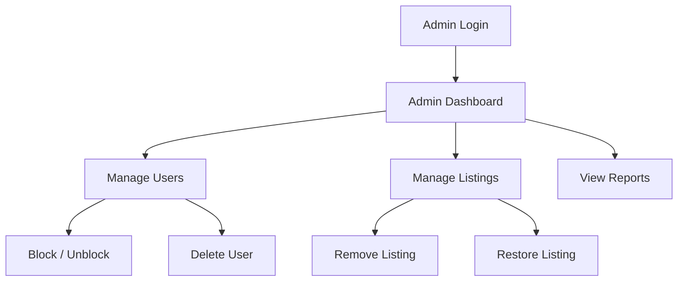

# User Flow Diagrams

## Authentication Flow

## Dashboard Navigation

## Donation Posting Flow

## Item Request Flow

## Messaging Flow

## Admin Management Flow

## Logout Flow

---

*Last updated: May 2026*
