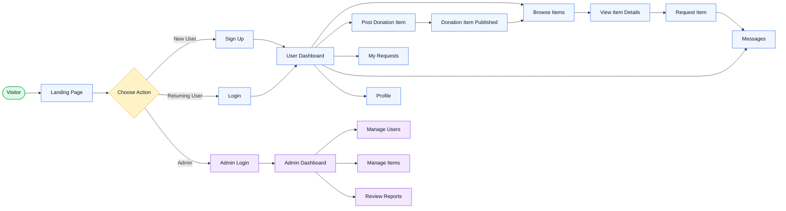
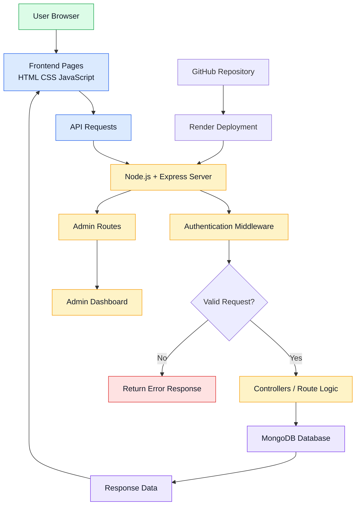
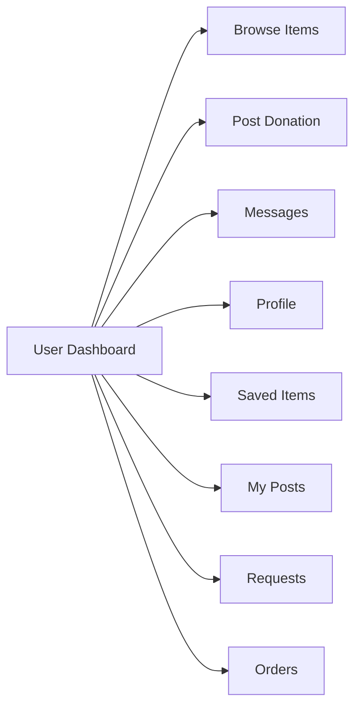
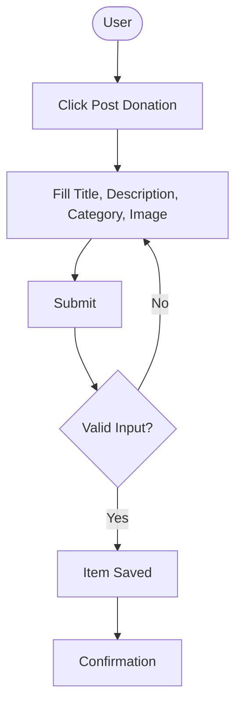
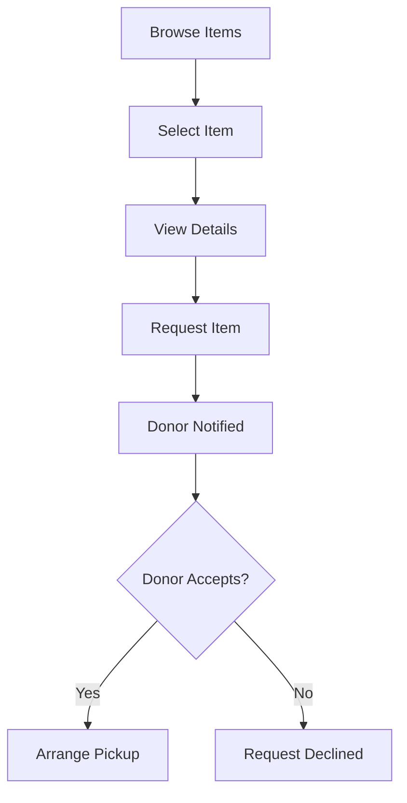
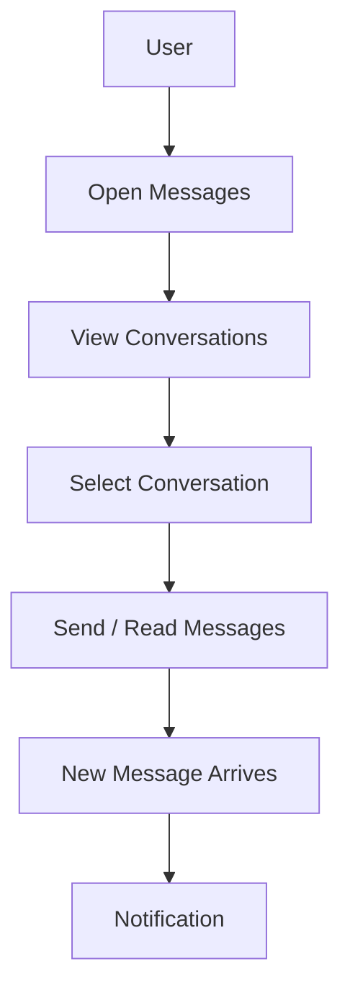
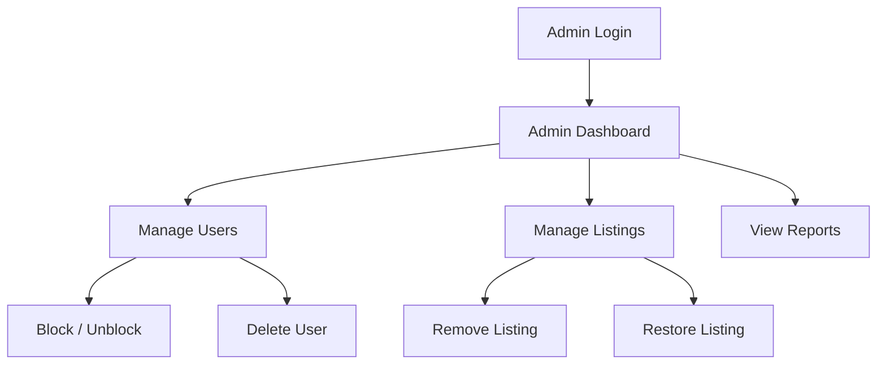
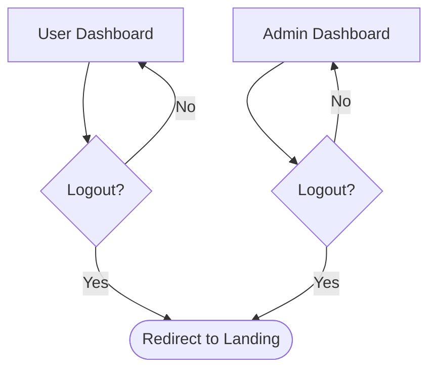

# User Flow and App Workflow

> Complete visual guide to the Free Sewaa platform — from user journeys to system architecture and donation flow.

---

## App Workflow

This diagram shows the main Free Sewaa user journey from entering the platform to donating, requesting, messaging, and admin review.

The app workflow covers the complete user journey. Visitors can sign up as new users, log in as returning users, or access the admin panel directly. Once logged in, users can browse donation items, post items to give away, view their requests, send messages, and manage their profile. The admin panel provides tools for managing users, items, and reports.

---

## System Workflow

This diagram shows how the frontend, backend, authentication, database, and deployment work together.

The system architecture follows a standard client-server model. The user's browser sends requests to the Node.js + Express backend, which processes authentication, routes logic, and queries MongoDB. Responses flow back through the same path. Admin routes are handled separately with their own access controls.

---

## Donation Request Flow

This diagram shows how a donated item moves through the platform.

```mermaid
flowchart LR
    A[Donor Posts Item] --> B[Item Appears in Browse Page]
    B --> C[Receiver Views Item]
    C --> D[Receiver Sends Request]
    D --> E[Donor and Receiver Communicate]
    E --> F[Item Handover]
    F --> G[Request Completed]

    classDef donor fill:#DCFCE7,stroke:#16A34A,color:#111827;
    classDef receiver fill:#DBEAFE,stroke:#2563EB,color:#111827;
    classDef process fill:#F8FAFC,stroke:#64748B,color:#111827;
    classDef done fill:#ECFDF5,stroke:#059669,color:#111827;

    class A donor;
    class C,D receiver;
    class B,E,F process;
    class G done;
```

The donation flow begins when a donor posts an item, which immediately appears in the browse page. A receiver can view the item and send a request. The donor and receiver then communicate through the messaging system and arrange a handover. Once the item changes hands, the request is marked as completed.

---

## Authentication Flow

## Dashboard Navigation

## Donation Posting Flow

## Item Request Flow

## Messaging Flow

## Admin Management Flow

## Logout Flow

---

*Last updated: May 2026*
