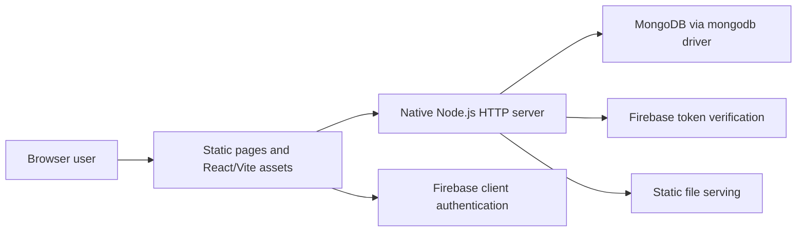

# Final Architecture

## Current Components

| Component | Responsibility |
|---|---|
| Browser interface | Forms, listings, requests, messages, panels, and responsive states |
| Native HTTP server | Request parsing, API dispatch, static serving, JSON, and error responses |
| MongoDB driver | Database connection and collection operations |
| Local account flow | Local signup/signin; password handling requires production hardening |
| Firebase flow | Identity-token verification and application-user mapping |
| Render and Vercel | Public demonstration targets |

## Request and Data Flow

1. Browser JavaScript sends an HTTP request.
2. The server parses method, URL, body, and available identity.
3. Route logic validates required fields and permissions where implemented.
4. MongoDB operations read or update application collections.
5. The server returns JSON or a page/asset.
6. The interface renders success, empty, or error feedback.

## Security Boundary

Firebase identity tokens are externally verified. The active local account path stores and compares password values directly, so it is an academic-MVP limitation and must be hashed or removed before production use. Central validation, authorization consistency, abuse controls, and wider security testing also remain.

## Historical Designs

Earlier documents and commits include Express, Mongoose, JWT, and bcrypt-oriented architecture. They show project evolution but are not the final runtime reference.

- [Architecture history](../03-design-and-planning/architecture/README.md)
- [Current server](../../server/server.js)
- [UML collection](../../docs/Project_UML%20diagram/README.md)
