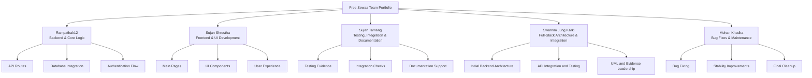

# 08 — Individual Team Portfolios

> This section presents each Free Sewaa team member's individual contribution, technical ownership, evidence of work, AI usage reflection, and personal learning journey. Each portfolio is written in the member's own voice and reflects their honest role in the project.

---

## Team Overview

| Badge | Member | GitHub | Role | Primary Contribution |
|-------|--------|--------|------|---------------------|
|  | **Ram Pathak** | [@Rampathak12](https://github.com/Rampathak12) | Backend & Core Logic | API routes, database integration, JWT authentication |
|  | **Sujan Shrestha** | [@SujanShrestha](https://github.com/suzmoon) | Frontend & UI Development | Main pages, navigation, UI components, project coordination |
|  | **Sujan Tamang** | [@SujanTamang](https://github.com/SujanTamang20) | Testing, Integration & Docs | QA strategy, checklists, bug reporting, integration testing |
|  | **Swarnim Jung Karki** | [@SwarnimJungKarki](https://github.com/Swarnimkarki50) | Full-Stack Architecture & Integration | Initial backend architecture, API integration, security/testing, CI, UML, and final evidence |
|  | **Mohan Khadka** | [@MohanKhadka](https://github.com/Mohankhadkaa) | Bug Fixes & Maintenance | Debugging, stability improvements, issue tracking, final cleanup |

---

## How to Review

1. Start with the **Member Portfolio Links** table below — each row links to a full portfolio page.
2. Open each member's file to see their role summary, key contributions with evidence links, and personal reflection.
3. All evidence links point to real files in this repository — click them to verify.
4. Use the **Portfolio Quality Checklist** to confirm each page meets the required criteria.

---

## Visual Overview

---

## Portfolio Quality Checklist

| # | Criterion | Status |
|---|-----------|--------|
| 1 | Each team member has an individual portfolio page | ✓ Complete |
| 2 | Each page includes role and responsibilities | ✓ Complete |
| 3 | Each page includes a key contributions table with evidence links | ✓ Complete |
| 4 | Each page includes an AI usage reflection | ✓ Complete |
| 5 | Each page includes challenges and solutions | ✓ Complete |
| 6 | Each page includes learning reflection | ✓ Complete |
| 7 | Each page includes presentation readiness points | ✓ Complete |
| 8 | All evidence links are real and working | ✓ Verified |
| 9 | Each page follows consistent section formatting | ✓ Applied |
| 10 | Navigation links work (back to section, back to home) | ✓ Verified |

---

## Member Portfolio Links

| # | Member | Role | Key Evidence | Portfolio |
|---|--------|------|-------------|-----------|
| 1 | **Ram Pathak** (`Rampathak12`) | Backend & Core Logic | [API Reference](../../docs/DESIGN/API_REFERENCE.md) · [Database Schema](../../docs/DESIGN/DATABASE_SCHEMA.md) · [Authentication](../../docs/AUTHENTICATION.md) · [Server Code](../../server/server.js) | [View Portfolio](./Rampathak12.md) |
| 2 | **Sujan Shrestha** | Frontend & UI Development | [UI Flow](../../docs/DESIGN/UI_FLOW.md) · [Frontend Guide](../../docs/FRONTEND_GUIDE.md) · [Wireframes](../../docs/DESIGN/WIREFRAMES.md) · [HTML Pages](../../html/) | [View Portfolio](./Sujan_Shrestha.md) |
| 3 | **Sujan Tamang** | Testing, Integration & Docs | [Testing Strategy](../../docs/TESTING_STRATEGY.md) · [QA Checklists](../../MANUAL_TESTING_CHECKLIST.md) · [Bug Reports](../../docs/ISSUES/BUGS/) · [Testing Log](../../docs/PROGRESS/TESTING_LOG.md) | [View Portfolio](./Sujan_Tamang.md) |
| 4 | **Swarnim Jung Karki** | Full-Stack Systems & Evidence | [Initial Backend PR #61](https://github.com/CapstoneDesign-Spring2026-UlsanCollege/Free_Sewaa/pull/61) · [API Integration](https://github.com/CapstoneDesign-Spring2026-UlsanCollege/Free_Sewaa/commit/cfc466fc0496f4f2da16d7eb15a7892ce0253c9b) · [Server Tests](../../server/__tests__/api.test.js) · [UML Evidence](../../docs/Project_UML%20diagram/README.md) · [Final Audit](../FINAL_PORTFOLIO_AUDIT.md) | [View Portfolio](./Swarnim_Jung_Karki.md) |
| 5 | **Mohan Khadka** | Bug Fixes & Maintenance | [Bug Reports](../../docs/ISSUES/BUGS/) · [Project Board](../../PROJECT_BOARD.md) · [QA Checklist](../../docs/QA_CHECKLIST.md) · [Testing Checklist](../../MANUAL_TESTING_CHECKLIST.md) | [View Portfolio](./Mohan_Khadka.md) |

> **Note:** All evidence links above point to real files in this repository. If a link does not resolve, please verify the file path from the repository root.

---

## Navigation

- [Back to Portfolio Home](../README.md)
- [Back to Main Repository](../../README.md)
- [View UML and Mermaid Diagrams](../../docs/UML_AND_MERMAID_DIAGRAMS.md)
- [View Project UML Diagrams](../../docs/Project_UML%20diagram/USER_FLOW_DIAGRAM.md)

---

*Free Sewaa — Capstone Design, Spring 2026, Ulsan College*
