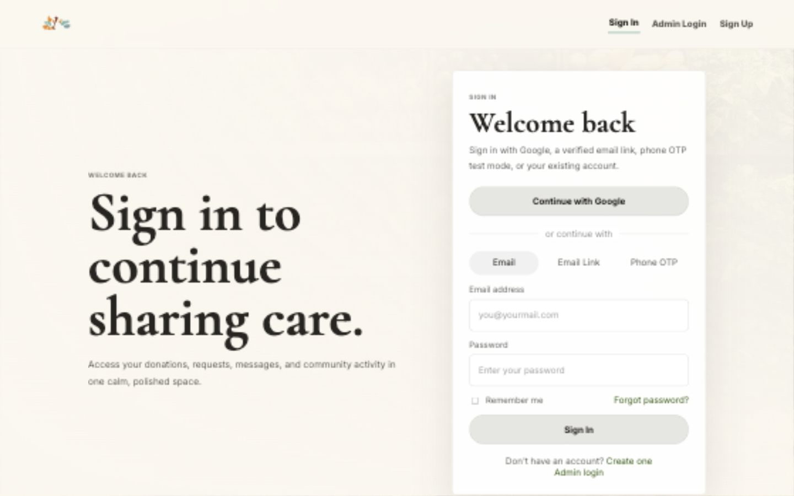

# Swarnim Jung Karki - Final Individual Portfolio

## Executive Summary

I contributed to Free Sewaa as a **full-stack systems, authentication, and
evidence contributor**. My work spans the project lifecycle: initial
Node.js/Express/MongoDB architecture, frontend-to-backend API integration,
Firebase identity verification, security improvements, automated tests, CI,
UML diagrams, and final submission evidence.

My strongest technical contribution is the identity path that connects
Firebase Google, email-link, and phone verification to the Free Sewaa backend
and MongoDB user model. I can explain this implementation from the browser
event through token verification, account synchronization, session creation,
and authorization boundaries.

> **Ownership boundary:** I claim the work shown by my authored commits and
> linked evidence. I do not claim sole ownership of shared files after later
> team revisions, teammate-authored work, or production readiness beyond what
> the evidence demonstrates.

## Professor Quick Review

If this page is being graded quickly, my strongest individual evidence is the
combination of **backend architecture**, **Firebase identity integration**,
**API wiring**, **tests/CI**, and **final evidence organization**.

| Review area | What to check first |
| --- | --- |
| Full-stack role | [Initial backend PR #61](https://github.com/CapstoneDesign-Spring2026-UlsanCollege/Free_Sewaa/pull/61), [API integration commit `cfc466f`](https://github.com/CapstoneDesign-Spring2026-UlsanCollege/Free_Sewaa/commit/cfc466fc0496f4f2da16d7eb15a7892ce0253c9b) |
| Main final technical contribution | [Firebase Google/email/phone commit `14d2338`](https://github.com/CapstoneDesign-Spring2026-UlsanCollege/Free_Sewaa/commit/14d23389686a056bf8fcbdc72d0fcd46587c6e7f), [authentication documentation](../../docs/AUTHENTICATION.md) |
| Verification evidence | [Firebase CI run](https://github.com/CapstoneDesign-Spring2026-UlsanCollege/Free_Sewaa/actions/runs/27520993789), [final screenshot CI run](https://github.com/CapstoneDesign-Spring2026-UlsanCollege/Free_Sewaa/actions/runs/27533493046) |
| Final product proof | [Live Render MVP](https://free-sewaa-qh05.onrender.com), [final release](https://github.com/CapstoneDesign-Spring2026-UlsanCollege/Free_Sewaa/releases/tag/v1.0.0-final-capstone), [final screenshots](../../docs/assets/screenshots/README.md) |
| Presentation readiness | [Final presentation materials](../07-final-presentation/README.md), [technical defense prep](../07-final-presentation/TECHNICAL_DEFENSE_PREP.md) |

My page is strongest when read as a connected technical story: I helped move
Free Sewaa from early static pages toward a defensible full-stack MVP, then
documented the evidence needed for another person to verify that work.

## 1. My Role

**Primary role:** Full-stack architecture and integration

**Specialization:** Backend foundations, Firebase identity, API integration,
quality evidence, and technical documentation

My responsibilities included:

- creating the initial structured Express and MongoDB backend;
- connecting browser interfaces to backend API behavior;
- implementing Firebase Google, email-link, and phone verification paths;
- verifying Firebase ID tokens in the backend and synchronizing MongoDB users;
- adding focused Jest tests and maintaining CI evidence;
- improving UML diagrams and explaining system boundaries; and
- organizing verifiable final-portfolio and screenshot evidence.

This combination distinguishes my contribution: I worked across the user
interface, authentication provider, backend, database, tests, deployment
configuration, and final technical explanation.

## 2. My Strongest Contributions

| Contribution | What I delivered | Verifiable evidence |
| --- | --- | --- |
| Initial backend architecture | A structured Express/MongoDB baseline with models, controllers, routes, middleware, configuration, and a server entry point | [PR #61](https://github.com/CapstoneDesign-Spring2026-UlsanCollege/Free_Sewaa/pull/61), [`585cc74`](https://github.com/CapstoneDesign-Spring2026-UlsanCollege/Free_Sewaa/commit/585cc7409c1de455d87771ccd1efde09bb872a9b) |
| Frontend/API integration | An API helper and browser-to-server connections for signup, browse, donate, and shared behavior | [`cfc466f`](https://github.com/CapstoneDesign-Spring2026-UlsanCollege/Free_Sewaa/commit/cfc466fc0496f4f2da16d7eb15a7892ce0253c9b), [Final MVP demo](../04-final-product/FINAL_MVP_DEMO.md) |
| Firebase identity integration | Google Sign-In, email links, phone OTP, backend ID-token verification, and MongoDB profile synchronization | [`14d2338`](https://github.com/CapstoneDesign-Spring2026-UlsanCollege/Free_Sewaa/commit/14d23389686a056bf8fcbdc72d0fcd46587c6e7f), [authentication documentation](../../docs/AUTHENTICATION.md) |
| Korean phone verification | `010` to `+82` normalization, validation, Firebase test-number support, and useful billing/quota errors | [`badb636`](https://github.com/CapstoneDesign-Spring2026-UlsanCollege/Free_Sewaa/commit/badb6369aaee0b2ad53fa7cb61bfda2c2bfec6a7), [`de8fb78`](https://github.com/CapstoneDesign-Spring2026-UlsanCollege/Free_Sewaa/commit/de8fb781b5fdf156e5a47ce42438114e49a3a33c) |
| Testing and CI | Focused API tests, Firebase configuration and malformed-token checks, and successful GitHub Actions runs | [`a8dd0cc`](https://github.com/CapstoneDesign-Spring2026-UlsanCollege/Free_Sewaa/commit/a8dd0ccf01e37809ae07f5977978bfaba97216d6), [Firebase CI run](https://github.com/CapstoneDesign-Spring2026-UlsanCollege/Free_Sewaa/actions/runs/27520993789) |
| UML and final evidence | Clearer user-flow diagrams, portfolio audit material, and privacy-conscious final MVP screenshots | [UML documentation](../../docs/Project_UML%20diagram/README.md), [`a80a0c3`](https://github.com/CapstoneDesign-Spring2026-UlsanCollege/Free_Sewaa/commit/a80a0c3451640051f2ce4f3f9d6dd6935b913367) |
| Final grading package | Public release, presentation links, screenshots, and closure evidence for fast professor review | [final release](https://github.com/CapstoneDesign-Spring2026-UlsanCollege/Free_Sewaa/releases/tag/v1.0.0-final-capstone), [presentation materials](../07-final-presentation/README.md), [final audit](../FINAL_PORTFOLIO_AUDIT.md) |

### Contribution 1: Backend Foundation

The project needed server-side structure instead of disconnected page
prototypes. In [PR #61](https://github.com/CapstoneDesign-Spring2026-UlsanCollege/Free_Sewaa/pull/61)
and [`585cc74`](https://github.com/CapstoneDesign-Spring2026-UlsanCollege/Free_Sewaa/commit/585cc7409c1de455d87771ccd1efde09bb872a9b),
I added the initial architecture for users, items, requests, messages, and
authentication. The commit introduced 20 backend files covering configuration,
models, controllers, routes, middleware, and server startup.

This contribution gave the team a technical vocabulary for routes,
controllers, persistence, authentication, and error handling. The current
shared server was later expanded and reorganized, so I describe this accurately
as the **initial backend foundation**, not sole ownership of the final server.

### Contribution 2: Cross-Layer API Integration

In [`cfc466f`](https://github.com/CapstoneDesign-Spring2026-UlsanCollege/Free_Sewaa/commit/cfc466fc0496f4f2da16d7eb15a7892ce0253c9b),
I connected frontend scripts to backend resources. This turned browser actions
into API requests with success and failure paths, helping move the application
from static presentation toward a demonstrable full-stack MVP.

The original file paths later changed, but the commit remains direct evidence
that I worked across the frontend/backend boundary rather than only on one
layer.

### Contribution 3: Firebase Identity Verification

In the signed commit
[`14d2338`](https://github.com/CapstoneDesign-Spring2026-UlsanCollege/Free_Sewaa/commit/14d23389686a056bf8fcbdc72d0fcd46587c6e7f),
I implemented the main Firebase identity path across ten files. The work added
or revised:

- Google account selection with popup and redirect handling;
- Firebase passwordless email sign-in links;
- phone OTP with invisible reCAPTCHA;
- the `POST /api/auth/firebase` token-exchange endpoint;
- server-side RS256 signature verification using Google's certificates;
- issuer, audience, expiry, provider, email, and phone claim validation;
- MongoDB user lookup, creation, and identity synchronization;
- Firebase configuration and deployment environment alignment;
- provider-specific errors and user guidance; and
- automated checks for the Firebase configuration, controls, and malformed
  tokens.

Follow-up commits
[`d17f02c`](https://github.com/CapstoneDesign-Spring2026-UlsanCollege/Free_Sewaa/commit/d17f02c88005a25c5f7fc2ac5b174580c436f774),
[`badb636`](https://github.com/CapstoneDesign-Spring2026-UlsanCollege/Free_Sewaa/commit/badb6369aaee0b2ad53fa7cb61bfda2c2bfec6a7),
and [`de8fb78`](https://github.com/CapstoneDesign-Spring2026-UlsanCollege/Free_Sewaa/commit/de8fb781b5fdf156e5a47ce42438114e49a3a33c)
refined email-link completion, Google login behavior, test-number verification,
and Korean phone validation.

## 3. Technical Area I Can Explain: Firebase-to-MongoDB Authentication

```mermaid
flowchart LR
    User["User chooses Google, email link, or phone OTP"]
    Firebase["Firebase verifies identity"]
    Token["Browser receives Firebase ID token"]
    API["POST /api/auth/firebase"]
    Verify["Verify RS256 signature, issuer, audience, expiry, and claims"]
    Profile["Find or create MongoDB user profile"]
    Session["Return Free Sewaa user and session data"]
    App["Open member workspace"]

    User --> Firebase
    Firebase --> Token
    Token --> API
    API --> Verify
    Verify --> Profile
    Profile --> Session
    Session --> App
```

### Client Flow

The browser initializes Firebase using the active `freesewaa-c8a41` project.
After Google, email-link, or phone verification, it requests a fresh Firebase
ID token and sends that token to `/api/auth/firebase`. A Firebase login is not
treated as a Free Sewaa session until the backend accepts the token.

### Backend Verification

The server:

1. decodes the token header and claims;
2. requires the Firebase RS256 signing algorithm and key identifier;
3. checks that `aud` and `iss` belong to `freesewaa-c8a41`;
4. rejects expired tokens;
5. downloads and caches Google's Firebase signing certificates;
6. verifies the cryptographic signature;
7. validates provider-specific email or phone claims; and
8. creates or updates the corresponding MongoDB user.

This prevents the browser from granting itself an authenticated account by
submitting unverified profile data.

### Identity and Authorization Boundary

Firebase proves the user's external identity. MongoDB stores the Free Sewaa
application profile, role, provider, verification status, and activity data.
Google or phone authentication does not automatically create an administrator:
the backend still applies the separate configured-superadmin check.

### Korean Phone Handling

The client accepts Korean mobile formats such as `010-1234-5678` and converts
them to Firebase's international `+821012345678` format. Invalid Korean formats
are rejected before reCAPTCHA and OTP processing.

Firebase test-number OTP is available for a repeatable no-cost demonstration.
Real SMS delivery is **not** claimed as universally available: it depends on
Firebase billing, quota, regional policy, and abuse protection. Google or
email-link authentication remains the more reliable free-tier demo path.

## 4. One Problem I Solved

### Problem

The interface displayed multiple authentication choices, but a professional
MVP needed those choices to produce a verified backend identity instead of
remaining UI-only controls. Korean phone input also needed a predictable format
for Firebase.

### Action

I connected the authentication controls to Firebase, exchanged the resulting
ID token with the backend, implemented certificate-based token verification,
synchronized MongoDB users, added provider-specific validation, normalized
Korean phone numbers, and added tests and documentation.

### Result

The project gained a defensible identity architecture:

- Google users can move from provider verification to the member workspace;
- email-link users prove ownership through Firebase's passwordless flow;
- phone users have reCAPTCHA, OTP, Korean normalization, and test-mode support;
- the backend rejects malformed, expired, wrongly issued, or incorrectly
  signed tokens;
- user records remain connected to the MongoDB application model; and
- administrator access remains separate from public authentication.

### Verification and Limitations

The Firebase implementation commits are signed and their CI runs passed. The
current Jest suite verifies the final Firebase project configuration, required
authentication controls, malformed-token rejection, health behavior, and
selected signup validation.

This is an academic MVP, not a production identity platform. Real phone SMS can
require Firebase billing, and broad end-to-end authentication automation remains
future work.

## 5. AI Use and Human Verification

I used AI for brainstorming implementation options, debugging hypotheses,
test-case ideas, Mermaid structure, and evidence organization. AI did not decide
whether a feature was complete or who owned it.

My human-verification process was:

1. inspect the generated diff and understand the affected control flow;
2. compare implementation claims with the actual frontend, backend, tests, and
   deployment configuration;
3. run or inspect CI and relevant tests;
4. verify commits, authors, PRs, issues, and relative links;
5. distinguish provider identity from application authorization; and
6. narrow claims when real-world limits, such as Firebase SMS billing, were not
   under the application's control.

This process is visible in the follow-up Firebase commits: I did not stop after
adding the interface. I iterated on email links, Google popup behavior, phone
test mode, Korean formatting, error messages, and verification evidence.

## 6. Eight Representative Commits

| # | Date | Commit | Contribution | Why it is strong evidence |
| ---: | --- | --- | --- | --- |
| 1 | 2026-04-08 | [`585cc74`](https://github.com/CapstoneDesign-Spring2026-UlsanCollege/Free_Sewaa/commit/585cc7409c1de455d87771ccd1efde09bb872a9b) | Initial Express/MongoDB architecture | Shows broad backend structure across 20 files |
| 2 | 2026-04-08 | [`cfc466f`](https://github.com/CapstoneDesign-Spring2026-UlsanCollege/Free_Sewaa/commit/cfc466fc0496f4f2da16d7eb15a7892ce0253c9b) | Frontend/API integration | Proves cross-layer implementation |
| 3 | 2026-05-16 | [`a8dd0cc`](https://github.com/CapstoneDesign-Spring2026-UlsanCollege/Free_Sewaa/commit/a8dd0ccf01e37809ae07f5977978bfaba97216d6) | Jest health and authentication tests | Provides direct automated-test evidence |
| 4 | 2026-06-15 | [`14d2338`](https://github.com/CapstoneDesign-Spring2026-UlsanCollege/Free_Sewaa/commit/14d23389686a056bf8fcbdc72d0fcd46587c6e7f) | Firebase Google, email, and OTP integration | Main final authentication implementation across ten files |
| 5 | 2026-06-15 | [`d17f02c`](https://github.com/CapstoneDesign-Spring2026-UlsanCollege/Free_Sewaa/commit/d17f02c88005a25c5f7fc2ac5b174580c436f774) | Authentication flow corrections and tests | Shows verification and iteration after initial delivery |
| 6 | 2026-06-15 | [`badb636`](https://github.com/CapstoneDesign-Spring2026-UlsanCollege/Free_Sewaa/commit/badb6369aaee0b2ad53fa7cb61bfda2c2bfec6a7) | Google and Korean phone fixes | Demonstrates regional and failure-mode handling |
| 7 | 2026-06-15 | [`de8fb78`](https://github.com/CapstoneDesign-Spring2026-UlsanCollege/Free_Sewaa/commit/de8fb781b5fdf156e5a47ce42438114e49a3a33c) | Korean phone validation | Narrows accepted input to defensible mobile formats |
| 8 | 2026-06-15 | [`a80a0c3`](https://github.com/CapstoneDesign-Spring2026-UlsanCollege/Free_Sewaa/commit/a80a0c3451640051f2ce4f3f9d6dd6935b913367) | Final MVP screenshot evidence | Proves privacy-conscious final product verification |

All four June 15 Firebase implementation commits above passed the repository's
CI workflow. The
[main Firebase CI run](https://github.com/CapstoneDesign-Spring2026-UlsanCollege/Free_Sewaa/actions/runs/27520993789)
and the
[final screenshot CI run](https://github.com/CapstoneDesign-Spring2026-UlsanCollege/Free_Sewaa/actions/runs/27533493046)
provide direct execution evidence.

## 7. Five Best Evidence Links

1. [PR #61 - Initial backend architecture](https://github.com/CapstoneDesign-Spring2026-UlsanCollege/Free_Sewaa/pull/61)
   My strongest early architecture evidence: a structured backend foundation
   spanning 20 files.

2. [Commit `14d2338` - Firebase Google and OTP verification](https://github.com/CapstoneDesign-Spring2026-UlsanCollege/Free_Sewaa/commit/14d23389686a056bf8fcbdc72d0fcd46587c6e7f)
   My strongest final technical evidence: client authentication, backend token
   verification, database synchronization, tests, deployment configuration,
   and documentation.

3. [Commit `cfc466f` - Frontend/API integration](https://github.com/CapstoneDesign-Spring2026-UlsanCollege/Free_Sewaa/commit/cfc466fc0496f4f2da16d7eb15a7892ce0253c9b)
   Proof that I connected interface behavior to backend resources.

4. [Authentication architecture and limitations](../../docs/AUTHENTICATION.md)
   A defendable explanation of Google, email-link, phone OTP, token exchange,
   MongoDB synchronization, admin separation, and Firebase limitations.

5. [Final MVP screenshot gallery](../../docs/assets/screenshots/README.md)
   Public visual evidence for authentication, the member workspace, messaging,
   browse, donation, events, and the landing page.

## 8. Defense Questions I Can Answer

| Question | My answer should prove |
| --- | --- |
| How does Firebase login become a Free Sewaa login? | Firebase verifies identity first; the browser sends an ID token to `/api/auth/firebase`; the backend verifies the token and synchronizes the MongoDB user before returning app session data. |
| Why is backend token verification necessary? | Browser profile data alone is not trusted; the backend checks issuer, audience, expiry, signing key, signature, and provider claims. |
| What did I contribute to the backend? | I built the initial Express/MongoDB architecture and later contributed Firebase token exchange and user synchronization evidence. I do not claim sole ownership of the final shared server. |
| How is Korean phone OTP handled? | Local `010` mobile input is normalized to `+82`, invalid mobile formats are rejected, Firebase test numbers support free demos, and real SMS is documented as quota/billing dependent. |
| How is admin access separated from public authentication? | Google, email, or phone identity can create a member account, but admin access still depends on configured admin authorization rather than public provider login. |
| What remains deferred after capstone? | Centralized validation, full local-password retirement or hardening, rate limiting, broader E2E tests, monitoring, and production SMS/email reliability. |

## 9. Honest Limitations and Deferred Work

- Issue #95 is recorded in the [final portfolio audit](../FINAL_PORTFOLIO_AUDIT.md)
  as closed **not planned** for the final capstone; centralized validation was
  deferred, not implemented by closing the issue.
- Firebase test-number OTP is repeatable, but real SMS remains dependent on
  billing, quota, regional policy, and abuse controls.
- The automated suite covers selected API and Firebase configuration behavior,
  not every provider's full browser journey.
- Local email/password compatibility remains and should eventually be retired
  or fully hardened.
- The repository contains historical and current architecture, so I identify
  which evidence proves an initial foundation and which evidence reflects the
  final implementation.

These limitations strengthen the credibility of my portfolio because they show
that I understand the difference between an academic MVP and a
production-hardened service.

## 10. Reflection

My biggest growth was learning to think in complete system paths. A login
button is not an authentication feature by itself. The real feature includes a
provider, browser state, token exchange, cryptographic verification, database
identity, authorization, error handling, tests, deployment configuration, and
clear documentation.

I also learned that strong engineering work needs a strong proof trail.
Commits, CI runs, diagrams, screenshots, limitations, and ownership boundaries
make technical work reviewable. My final contribution is stronger because I can
both explain the architecture and show exactly where it came from.

If I continued the project, I would add broader end-to-end provider tests,
centralize validation schemas, retire the legacy password path, and add
production rate limiting and monitoring. I would preserve the same principle
used in this portfolio: claim only what can be demonstrated.

## Git Identity Note

My semester commits appear under several historical email aliases, including
`swarnimkarki60@gmail.com`, `swarnimkarki50@gmail.com`, GitHub noreply
addresses, and an early local-machine address. My recent signed commits use
`Swarnim Jung Karki <swarnimkarki60@gmail.com>` and are associated with
[@Swarnimkarki50](https://github.com/Swarnimkarki50).

## Final Grading Statement

My evidence covers the complete range expected from a full-stack capstone
contributor:

- architecture and backend foundations;
- frontend-to-API integration;
- third-party identity integration;
- cryptographic token verification;
- MongoDB account synchronization;
- Korean localization and validation;
- testing and CI;
- UML and technical explanation; and
- final release, presentation, evidence, and honest risk reporting.

The strongest part of my submission is not the number of commits. It is the
connected technical story those commits prove.

## Navigation

- [Live Free Sewaa MVP](https://free-sewaa-qh05.onrender.com)
- [Final Capstone Release](https://github.com/CapstoneDesign-Spring2026-UlsanCollege/Free_Sewaa/releases/tag/v1.0.0-final-capstone)
- [Final MVP Demo Guide](../04-final-product/FINAL_MVP_DEMO.md)
- [Final Architecture](../04-final-product/ARCHITECTURE_FINAL.md)
- [Final Presentation Materials](../07-final-presentation/README.md)
- [Representative contribution evidence](../06-ai-and-code-ownership/representative-prs/README.md)
- [Back to Individual Portfolios](./README.md)
- [Back to Portfolio Home](../README.md)
