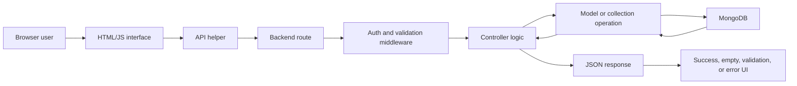

# Swarnim Jung Karki - Individual Portfolio

## Executive Summary

I contributed to Free Sewaa as a **full-stack systems and evidence contributor**.
My strongest work was turning separate prototype pages into a defensible
full-stack MVP story: initial backend architecture, frontend-to-API integration,
security improvement, automated tests, CI, UML diagrams, and final portfolio
evidence.

My best grading argument is simple: I can connect what I built to a user-facing
MVP flow, explain the technical path behind it, and prove the work through
commits, pull requests, issues, tests, diagrams, and final demo links.

> **Ownership boundary:** I claim my authored commits, initial backend
> architecture, API integration work, security/test/CI contributions, UML work,
> and evidence organization. I do not claim sole ownership of the final shared
> server, shared frontend files, or teammate-authored portfolio content.

## Fast Grading Evidence Map

| Grading area | What I can prove | Best evidence |
|---|---|---|
| Backend foundation | I created the first structured Express/MongoDB backend baseline with models, controllers, routes, middleware, configuration, and server entry point | [PR #61](https://github.com/CapstoneDesign-Spring2026-UlsanCollege/Free_Sewaa/pull/61), [`585cc74`](https://github.com/CapstoneDesign-Spring2026-UlsanCollege/Free_Sewaa/commit/585cc7409c1de455d87771ccd1efde09bb872a9b) |
| API integration | I connected frontend pages/scripts to backend API behavior so browser actions had a server path | [`cfc466f`](https://github.com/CapstoneDesign-Spring2026-UlsanCollege/Free_Sewaa/commit/cfc466fc0496f4f2da16d7eb15a7892ce0253c9b), [Issue #65](https://github.com/CapstoneDesign-Spring2026-UlsanCollege/Free_Sewaa/issues/65) |
| MVP vertical slice | I helped define and present the Post Item -> Browse Items -> Request Item flow | [Issue #39](https://github.com/CapstoneDesign-Spring2026-UlsanCollege/Free_Sewaa/issues/39), [PR #41](https://github.com/CapstoneDesign-Spring2026-UlsanCollege/Free_Sewaa/pull/41) |
| Security and QA | I added historical bcrypt work, focused Jest tests, and CI workflow safety | [`c1c8a9d`](https://github.com/CapstoneDesign-Spring2026-UlsanCollege/Free_Sewaa/commit/c1c8a9de3a755e0bfb1bbb5eecb4e0cbf3cc7549), [`a8dd0cc`](https://github.com/CapstoneDesign-Spring2026-UlsanCollege/Free_Sewaa/commit/a8dd0ccf01e37809ae07f5977978bfaba97216d6), [`36d3b13`](https://github.com/CapstoneDesign-Spring2026-UlsanCollege/Free_Sewaa/commit/36d3b13) |
| Diagrams and evidence | I improved UML/portfolio organization and created final audit evidence | [`2fe552d`](https://github.com/CapstoneDesign-Spring2026-UlsanCollege/Free_Sewaa/commit/2fe552dcd274754ed49c14b87e7ec125a6226e96), [`5d6f2c6`](https://github.com/CapstoneDesign-Spring2026-UlsanCollege/Free_Sewaa/commit/5d6f2c6), [`e60a6f0`](https://github.com/CapstoneDesign-Spring2026-UlsanCollege/Free_Sewaa/commit/e60a6f0) |

## MVP and Demo Evidence

| Evidence | Link | Why it matters |
|---|---|---|
| Live MVP | [Render deployment](https://free-sewaa-qh05.onrender.com) | Shows the project as a public working academic MVP |
| Final demo flow | [Final MVP Demo Guide](../04-final-product/FINAL_MVP_DEMO.md) | Lists the exact demo sequence: landing, account access, browse, post, request, message, admin, tests, limitations |
| Final architecture | [Final Architecture](../04-final-product/ARCHITECTURE_FINAL.md) | Separates current runtime from historical architecture |
| UML documentation | [Project UML diagrams](../../docs/Project_UML%20diagram/README.md) | Shows request, dashboard, auth, and admin flows |
| Final audit | [Final Portfolio Audit](../FINAL_PORTFOLIO_AUDIT.md) | Shows professor-checklist coverage and honest limitations |
| Representative ledger | [Representative PRs and commits](../06-ai-and-code-ownership/representative-prs/README.md) | Confirms author attribution and evidence boundaries |

## My Strongest Technical Story

Free Sewaa began with many page-level prototypes. My strongest contribution was
helping move the project toward a connected product path:

1. I created an initial backend architecture so users, items, requests,
   messages, and authentication had server-side structure.
2. I connected frontend behavior to API calls so pages could communicate with
   backend resources instead of staying browser-only.
3. I helped define the Post Item -> Browse Items -> Request Item flow as the
   core MVP story.
4. I added security, tests, and CI evidence so the project could be evaluated
   technically, not only visually.
5. I improved diagrams and portfolio evidence so the professor could verify
   what was built, who built it, and what limitations remained.

That combination is my strongest point among the team: I can defend both the
system design and the proof trail.

## Architecture I Can Explain

This is the technical area I can defend live. I can explain how a browser
action becomes an API request, how the backend decides what to do, how data is
read or written, how the response returns to the page, and where validation,
auth, database, or UI failures can occur.

## Contribution Case Studies

### 1. Initial Backend Architecture

**Problem:** The project needed server-side structure rather than keeping the
main product behavior only in static pages and browser scripts.

**Action:** In [PR #61](https://github.com/CapstoneDesign-Spring2026-UlsanCollege/Free_Sewaa/pull/61)
and [commit `585cc74`](https://github.com/CapstoneDesign-Spring2026-UlsanCollege/Free_Sewaa/commit/585cc7409c1de455d87771ccd1efde09bb872a9b),
I added 20 backend files: database config, resource models, controllers, routes,
JWT middleware, environment setup, and server entry point.

**Result:** The team received a structured backend baseline for users, items,
requests, messages, and authentication. It created a vocabulary for the team to
discuss API contracts, persistence, auth, and server responsibilities.

**Boundary:** This was the initial backend architecture. The current production
server was later replaced and expanded by teammates in shared files.

### 2. Frontend-to-Backend API Integration

**Problem:** A working MVP needed browser actions to reach backend resources
with predictable responses and error states.

**Action:** In [commit `cfc466f`](https://github.com/CapstoneDesign-Spring2026-UlsanCollege/Free_Sewaa/commit/cfc466fc0496f4f2da16d7eb15a7892ce0253c9b),
I added an API helper and connected browse, donate, signup, and shared scripts
to backend behavior. This work is tracked by
[Issue #65](https://github.com/CapstoneDesign-Spring2026-UlsanCollege/Free_Sewaa/issues/65).

**Result:** The project gained a clearer path from UI actions to API responses.
That made the donation and request flow easier to demonstrate and easier to
debug.

**Boundary:** The original root-level page paths changed later. This commit
proves the integration work, not ownership of every current page.

### 3. MVP Vertical Slice

**Problem:** The team needed one simple product story that a professor could
understand quickly.

**Action:** I helped define the Post Item -> Browse Items -> Request Item flow
through [Issue #39](https://github.com/CapstoneDesign-Spring2026-UlsanCollege/Free_Sewaa/issues/39)
and [PR #41](https://github.com/CapstoneDesign-Spring2026-UlsanCollege/Free_Sewaa/pull/41).

**Result:** The final demo could be explained as a coherent donation lifecycle:
someone posts an item, another user browses it, then the recipient requests or
contacts the donor.

**Boundary:** [PR #41](https://github.com/CapstoneDesign-Spring2026-UlsanCollege/Free_Sewaa/pull/41)
is workflow evidence because GitHub reports zero changed files. The stronger
implementation proof is the related issue and commits.

### 4. Security, Tests, and CI

**Problem:** A professional capstone needs more than UI. It needs testable
behavior and honest security discussion.

**Action:** I added historical bcrypt password work in
[commit `c1c8a9d`](https://github.com/CapstoneDesign-Spring2026-UlsanCollege/Free_Sewaa/commit/c1c8a9de3a755e0bfb1bbb5eecb4e0cbf3cc7549),
focused Jest tests in
[commit `a8dd0cc`](https://github.com/CapstoneDesign-Spring2026-UlsanCollege/Free_Sewaa/commit/a8dd0ccf01e37809ae07f5977978bfaba97216d6),
and CI safety in
[commit `36d3b13`](https://github.com/CapstoneDesign-Spring2026-UlsanCollege/Free_Sewaa/commit/36d3b13).

**Result:** The repository gained direct evidence for backend behavior and a
repeatable check path. The final project can point to a real Jest suite rather
than only manual testing.

**Boundary:** The current suite is focused, not comprehensive. [Issue #95](https://github.com/CapstoneDesign-Spring2026-UlsanCollege/Free_Sewaa/issues/95)
and the final architecture docs still identify centralized validation and
local-password hardening as future work.

### 5. UML and Evidence Leadership

**Problem:** Strong work is hard to grade if the proof is scattered or
overclaimed.

**Action:** I standardized individual portfolio structure and UML context in
[commit `2fe552d`](https://github.com/CapstoneDesign-Spring2026-UlsanCollege/Free_Sewaa/commit/2fe552dcd274754ed49c14b87e7ec125a6226e96),
fixed user-flow diagram ambiguity in
[commit `5d6f2c6`](https://github.com/CapstoneDesign-Spring2026-UlsanCollege/Free_Sewaa/commit/5d6f2c6),
and created the final portfolio audit in
[commit `e60a6f0`](https://github.com/CapstoneDesign-Spring2026-UlsanCollege/Free_Sewaa/commit/e60a6f0).

**Result:** The portfolio became easier to grade: sections are organized,
evidence is linked, limitations are visible, and individual ownership is not
invented.

## Professor Defense: What I Can Answer

| Question | My answer |
|---|---|
| What was your clearest technical contribution? | The initial backend architecture in PR #61 and commit `585cc74`, plus the API integration path in `cfc466f`. |
| Can you draw the request lifecycle? | Yes. I can trace UI input -> API helper -> route -> middleware -> controller -> model/database -> JSON response -> UI state. |
| How do you prove your work? | Through direct commit metadata, PRs, issues, current files, tests, UML docs, and the representative evidence ledger. |
| What is honest unfinished work? | Issue #95, centralized validation, broader test coverage, and production hardening of local password behavior. |
| Why should this score strongly? | My evidence covers architecture, integration, MVP flow, security, tests, CI, diagrams, and final audit. It is broad, technical, and verifiable. |

## AI Use and Human Verification

I used AI as a support tool for brainstorming, debugging hypotheses, test-case
ideas, Markdown structure, and evidence organization. I did not use AI as an
authority for ownership or completion claims.

My verification process was:

1. Inspect the diff before accepting generated work.
2. Check file paths, commit authors, PRs, issues, and current file states.
3. Run relevant tests or verify the affected workflow.
4. Separate historical architecture from current runtime.
5. Remove or narrow any claim that evidence did not support.

Important examples: I identify [PR #35](https://github.com/CapstoneDesign-Spring2026-UlsanCollege/Free_Sewaa/pull/35)
as shared branch history, treat [PR #41](https://github.com/CapstoneDesign-Spring2026-UlsanCollege/Free_Sewaa/pull/41)
as workflow evidence because it has zero changed files, and keep
[Issue #95](https://github.com/CapstoneDesign-Spring2026-UlsanCollege/Free_Sewaa/issues/95)
as remaining work rather than pretending validation is complete.

## Git Identity Note

My semester history appears under these author identities:

- `swarnimkarki60@gmail.com`
- `swarnimkarki50@gmail.com`
- `swarnimkarki50@users.noreply.github.com`
- `162858067+Swarnimkarki50@users.noreply.github.com`
- `jung@Swarnims-MacBook-Pro.local`

The author names include `Swarnim Jung Karki` and `Swarnimkarki50`. I use
focused representative evidence instead of a raw commit count because repository
history includes merges, reverts, generated files, and branch duplication.

## Eight Representative Commits

| # | Date | Commit | Grading category | Verified contribution | Boundary |
|---:|---|---|---|---|---|
| 1 | 2026-04-08 | [`585cc74`](https://github.com/CapstoneDesign-Spring2026-UlsanCollege/Free_Sewaa/commit/585cc7409c1de455d87771ccd1efde09bb872a9b) | Architecture | Initial backend models, controllers, routes, middleware, config, and server | Historical backend baseline |
| 2 | 2026-04-08 | [`cfc466f`](https://github.com/CapstoneDesign-Spring2026-UlsanCollege/Free_Sewaa/commit/cfc466fc0496f4f2da16d7eb15a7892ce0253c9b) | Integration | API helper and frontend-to-backend connection | Original paths later reorganized |
| 3 | 2026-05-16 | [`c1c8a9d`](https://github.com/CapstoneDesign-Spring2026-UlsanCollege/Free_Sewaa/commit/c1c8a9de3a755e0bfb1bbb5eecb4e0cbf3cc7549) | Security | Historical bcrypt password hashing and comparison | Final password risks remain |
| 4 | 2026-05-16 | [`a8dd0cc`](https://github.com/CapstoneDesign-Spring2026-UlsanCollege/Free_Sewaa/commit/a8dd0ccf01e37809ae07f5977978bfaba97216d6) | Testing | Jest health and authentication tests | Focused suite, not full coverage |
| 5 | 2026-05-22 | [`36d3b13`](https://github.com/CapstoneDesign-Spring2026-UlsanCollege/Free_Sewaa/commit/36d3b13) | CI | Safer GitHub Actions workflow behavior | Workflow later evolved |
| 6 | 2026-06-04 | [`2fe552d`](https://github.com/CapstoneDesign-Spring2026-UlsanCollege/Free_Sewaa/commit/2fe552dcd274754ed49c14b87e7ec125a6226e96) | Portfolio/UML | Individual portfolio template and UML overview | Organization is not teammate ownership |
| 7 | 2026-06-04 | [`5d6f2c6`](https://github.com/CapstoneDesign-Spring2026-UlsanCollege/Free_Sewaa/commit/5d6f2c6) | Diagram quality | Fixed user-flow ambiguity and dead ends | Shared docs later evolved |
| 8 | 2026-06-11 | [`e60a6f0`](https://github.com/CapstoneDesign-Spring2026-UlsanCollege/Free_Sewaa/commit/e60a6f0) | Final evidence | Final portfolio audit and MVP demo evidence refinement | Documentation/evidence contribution |

## Five Best Evidence Links

1. [PR #61 - Initial backend API](https://github.com/CapstoneDesign-Spring2026-UlsanCollege/Free_Sewaa/pull/61)
   proves the strongest single technical foundation: 20 backend files.
2. [Commit `cfc466f` - Frontend/API integration](https://github.com/CapstoneDesign-Spring2026-UlsanCollege/Free_Sewaa/commit/cfc466fc0496f4f2da16d7eb15a7892ce0253c9b)
   proves cross-layer integration work.
3. [Commit `a8dd0cc` - Jest tests](https://github.com/CapstoneDesign-Spring2026-UlsanCollege/Free_Sewaa/commit/a8dd0ccf01e37809ae07f5977978bfaba97216d6)
   proves direct automated-test work.
4. [Issue #94 - Security improvement trail](https://github.com/CapstoneDesign-Spring2026-UlsanCollege/Free_Sewaa/issues/94)
   connects security discussion to implementation evidence.
5. [PR #148 - Final capstone portfolio](https://github.com/CapstoneDesign-Spring2026-UlsanCollege/Free_Sewaa/pull/148)
   proves final evidence organization across the submission.

## Reflection

My biggest growth was learning to think like a full-stack engineer rather than
only a page builder. I learned that a feature is not just a screen: it includes
input handling, API design, auth boundaries, persistence, failure states, tests,
documentation, and a clear proof trail.

If I improved the project again, I would introduce shared validation schemas
earlier, expand integration and browser tests, keep one Git identity from the
start, and document architecture transitions as they happen. I would also keep
each PR smaller so the evidence is even easier to review.

The work I am most proud of is the backend/API foundation plus final evidence
clarity. That combination shows both technical implementation and professional
accountability.

## Navigation

- [Representative contribution evidence](../06-ai-and-code-ownership/representative-prs/README.md)
- [Final MVP Demo Guide](../04-final-product/FINAL_MVP_DEMO.md)
- [Final Architecture](../04-final-product/ARCHITECTURE_FINAL.md)
- [Project UML diagrams](../../docs/Project_UML%20diagram/README.md)
- [Back to Individual Portfolios](./README.md)
- [Back to Portfolio Home](../README.md)
